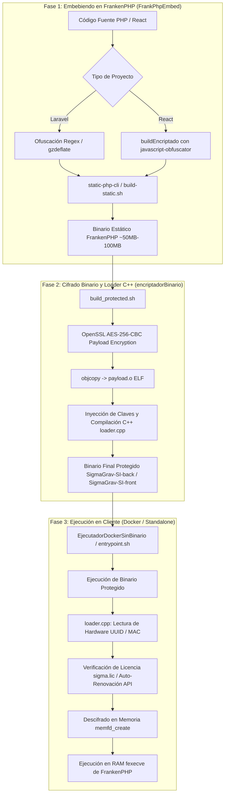

# Arquitectura y Flujo Actual de Protección y Licenciamiento

## 1. Visión General del Sistema

El ecosistema de protección de **SigmaGrav** está diseñado para prevenir la ingeniería inversa, el robo de propiedad intelectual y la ejecución no autorizada del software mediante la combinación de embebido de código, ofuscación, cifrado de binarios a nivel de ELF y control de licencias con bloqueo por hardware (HWID).



---

## 2. Componentes del Sistema

### 2.1. `FrankPhpEmbed` (`start_embed.sh`)
* **Ubicación:** `SigmaGrav-Tools/Herramientas/SigmaGrav/FrankPhpEmbed`
* **Función:** Empaqueta el código fuente (Laravel o React) dentro de un binario independiente de FrankenPHP (Go + PHP + Caddy + Extensiones).
* **Mecanismos clave:**
  * **Laravel:** 
    * Copia temporal del código eliminando `.git` y `node_modules`.
    * Optimización con `composer install --no-dev --optimize-autoloader` y cacheados de artisan (`config:cache`, `route:cache`, `view:cache`).
    * Ofuscación estática casera mediante regex: reemplaza variables locales y nombres de funciones privadas por hashes de 6 caracteres, remueve comentarios y minifica, y envuelve el código resultante en `eval(gzinflate(base64_decode(...)))`.
  * **React:**
    * Ejecuta `npm run buildEncriptado`, que utiliza `react-app-rewired` y `javascript-obfuscator` para transformar el bundle JS de React.
  * **Compilación Estática:**
    * Utiliza `static-php-cli` (`spc`) y el script `build-static.sh` para compilar el runtime de PHP 8.2 y las extensiones necesarias (`ctype,curl,dom,mbstring,posix,pcntl,intl,iconv,pdo,pdo_mysql,pdo_pgsql,gd,zip,opcache`) embebiendo todo el proyecto en la ruta `EMBED`.

### 2.2. `encriptadorBinario` (`build_protected.sh` y `loader.cpp`)
* **Ubicación:** `SigmaGrav-Tools/Herramientas/SigmaGrav/encriptadorBinario`
* **Función:** Aplica una segunda capa de cifrado simétrico al binario generado por FrankenPHP y lo envuelve en un cargador en C++ con verificación de licencias y cerrojo por hardware.
* **Mecanismos clave:**
  * **Cifrado del Payload (`build_protected.sh`):**
    * Genera claves aleatorias de 256 bits (`MASTER_KEY`, `PAYLOAD_KEY`, `PAYLOAD_IV`).
    * Cifra el binario FrankenPHP usando `openssl enc -aes-256-cbc`.
    * Convierte el archivo cifrado en un archivo objeto ELF (`payload.o`) usando `objcopy`.
    * Compila `loader.cpp` inyectando las claves y símbolos mediante macros `-D`.
  * **Cargador y Validador C++ (`loader.cpp`):**
    * **Validación de Hardware:** Lee el UUID del sistema (`/sys/class/dmi/id/product_uuid` o `dmidecode`) y la dirección MAC de la interfaz de red (`enp5s0`, `eth0`, etc.).
    * **Validación de Licencia:** Descifra y analiza la licencia local `sigma.lic` (vía `MASTER_KEY`). Si no existe o venció, realiza peticiones HTTP con libcurl al endpoint `/api/v1/license/renew` para autorrenovarla.
    * **Ejecución Segura en Memoria (Fileless Execution):**
      1. Crea un file descriptor anónimo en memoria mediante `memfd_create("sys_proc", MFD_CLOEXEC)`.
      2. Descifra el payload FrankenPHP directamente dentro del bloque de memoria (`mmap` + OpenSSL EVP API).
      3. Ejecuta el binario desde la memoria RAM invocando `fexecve(fd, ...)`. El código nunca toca el disco duro descifrado.
    * **Watcher en Segundo Plano:** Mantiene un hilo secundario (`watcher`) que audita cada 24 horas la validez de la licencia y la renueva automáticamente.

### 2.3. `EjecutadorDockerSinBinario`
* **Ubicación:** `SigmaGrav-Tools/Herramientas/SigmaGrav/EjecutadorDockerSinBinario`
* **Función:** Define el entorno de ejecución del cliente mediante contenedores Docker (`docker-compose.yml`, `entrypoint.sh`).
* **Mecanismos clave:**
  * Define contenedores para PostgreSQL (`postgres-db`), el bridge de Mercado Pago (`mp-bridge`), el Backend de Laravel (`sigmagrav-backend`), Scheduler (`sigmagrav-scheduler`) y Frontend (`sigmagrav-frontend`).
  * `entrypoint.sh` permite la actualización remota y rollback mediante git o verificación en la tabla `system_update_configs`.

---

## 3. Especificación Técnica de Claves y Parámetros

| Componente | Parámetro / Algoritmo | Descripción |
| :--- | :--- | :--- |
| **Cifrado de Payload** | AES-256-CBC | Cifra el binario completo de FrankenPHP |
| **Cifrado de Licencia** | AES-256-CBC | Cifra la estructura `LicenseData` (UUID, MAC, Expiry) |
| **Validación HWID** | DMI UUID + MAC Address | Asocia la ejecución a una placa madre e interfaz de red específica |
| **Carga en RAM** | `memfd_create` + `fexecve` | Ejecución volátil sin persistencia en disco |
| **Monitoreo Licencia** | `std::thread` watcher | Verificación periódica cada 24 horas |

---

## 4. Estructura de Datos de la Licencia (`LicenseData`)

```cpp
struct LicenseData {
    char uuid[64];      // UUID del hardware autorizado
    char mac[32];       // Dirección MAC autorizada
    long long expiry;   // Timestamp de expiración Unix
};
```

---

## 5. Resumen de Flujo de Datos para Asistentes de IA

Para cualquier análisis automatizado o agente IA:
1. El proyecto pasa por dos fases de build: `start_embed.sh` (compilación C/C++/Go de FrankenPHP) -> `build_protected.sh` (cifrado OpenSSL + compilación `loader.cpp`).
2. El resultado final es un executable ELF monolítico que contiene todo el código PHP/JS + el intérprete PHP/Caddy + el cargador de licencias C++.
3. La ejecución descifra el executable FrankenPHP directamente en RAM vía `memfd_create` y llama a `fexecve`, lo que oculta el binario original del sistema de archivos.
