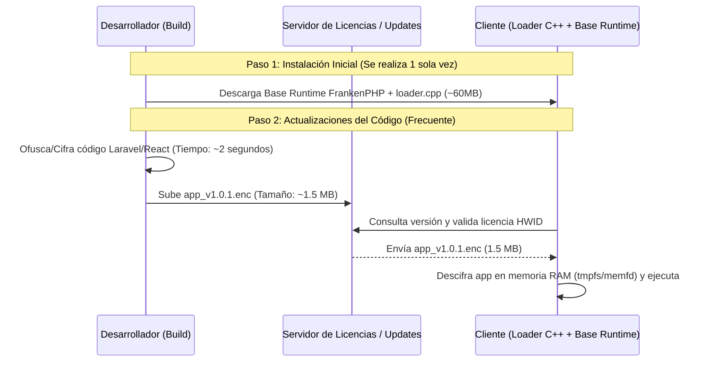

# Alternativas Gratuitas y Libres para la Protección de Código

Para resolver los dos grandes problemas (**tiempos de build eternos** y **descargas pesadas para los clientes**) manteniendo o mejorando la protección contra la ingeniería inversa y el licenciamiento, presentamos las siguientes alternativas de código abierto y de uso gratuito (open-source / libres).

---

## 1. Alternativa Arquitectónica Principal: Arquitectura Desacoplada (Runtime Fijo + Paquetes Cifrados Incrementales)

> **Esta es la recomendación N° 1 para solucionar de inmediato los problemas de rendimiento y tamaño de actualización.**

### 1.1. Concepto
En lugar de empaquetar todo (PHP + Caddy + App) en un binario gigante cada vez que cambias 1 línea de código:
1. **Compilar el Runtime de FrankenPHP + `loader.cpp` UNA SOLA VEZ** (o solo cuando cambien las extensiones de PHP o el servidor web). Este binario "Base" pesa ~50-80MB y se instala en el cliente una única vez.
2. **Cifrar el código de la aplicación (Laravel / React) en un paquete liviano (`app.pkg.enc` / `bundle.enc`)** utilizando AES-256-CBC o una extensión de lectura de memoria.
3. El `loader.cpp` descarga únicamente el paquete de actualización de la aplicación (que mide **entre 500 KB y 5 MB**), valida la licencia y desempaqueta/descifra los archivos de la app en memoria o en un filesystem virtual (`tmpfs` / `memfd`).

### 1.2. Ventajas
* **Tiempo de Build:** Pasa de **15 minutos** a **2 segundos**.
* **Tamaño de Descarga:** Pasa de **80 MB** a **1.5 MB**.
* **Mantención de Seguridad:** Se mantiene la verificación por hardware (HWID) y la validación periódica de la licencia en `loader.cpp`.

---

## 2. Alternativas Libres para Protección y Cifrado de PHP (Backend)

### 2.1. PHP-Beast (Extensión C de Cifrado para PHP)
* **Licencia:** Open Source (BSD / Apache style).
* **Repositorio:** [php-beast en GitHub](https://github.com/mbeast/php-beast)
* **Cómo Funciona:** 
  Es una extensión de PHP escrita en C. Te permite cifrar los archivos `.php` con una clave secreta (AES/DES) mediante una herramienta de línea de comandos. En el servidor, la extensión C `php-beast.so` descifra el código PHP transparente al vuelo directamente en el motor Zend antes de ejecutarlo.
* **Ventajas:**
  * Muy rápido rendimiento en ejecución (utiliza C nativo y se integra con OPcache).
  * Los archivos `.php` distribuidos en disco son totalmente ininteligibles / datos binarios cifrados.
  * Gratuito y sin límites de licencias.
* **Desventajas:**
  * Requiere incluir la extensión `php-beast.so` dentro del binario de PHP o la imagen Docker.

### 2.2. PHP Bolt (PHP Encryption Extension)
* **Licencia:** Gratuito para uso personal y comercial.
* **Repositorio:** [php-bolt en GitHub](https://github.com/araujo-daniel/php-bolt)
* **Cómo Funciona:** 
  Similar a PHP-Beast, es una extensión C para PHP (disponible para PHP 8.0, 8.1, 8.2, 8.3) que cifra los archivos de Laravel y los desencripta en memoria utilizando una clave personalizada.
* **Ventajas:**
  * Soporte nativo y probado para las versiones modernas de PHP (PHP 8.2+).
  * Integración limpia con Laravel.

### 2.3. YAKPRO-PO (YET ANOTHER KEYFRAME PROTECTION - PHP OBFUSCATOR)
* **Licencia:** MIT (Open Source).
* **Repositorio:** [yakpro-po en GitHub](https://github.com/pk-fr/yakpro-po)
* **Cómo Funciona:**
  Es un ofuscador basado en AST (Abstract Syntax Tree) usando `PHP-Parser`. A diferencia del script regex simple actual, YAKPRO-PO realiza:
  * Renombrado de variables, funciones, métodos y clases.
  * Alteración del flujo de control (Control Flow Obfuscation).
  * Remoción completa de comentarios y espacios.
  * Ofuscación de cadenas de texto y enteros.
* **Ventajas:**
  * Produce código PHP de alta ofuscación que sigue siendo ejecutable nativamente por cualquier intérprete de PHP sin necesidad de extensiones C especiales.
  * Compatible al 100% con PHP OPcache (rendimiento óptimo).

---

## 3. Alternativas Libres para Protección de JavaScript / React (Frontend)

### 3.1. AST Obfuscation + Custom Mangle (Terser + JavaScript-Obfuscator)
Actualmente el proyecto utiliza `javascript-obfuscator`. Se puede optimizar significativamente su configuración para reducir el tamaño final y maximizar la protección sin romper React:
* **Control Flow Flattening:** Dificulta el seguimiento de la lógica de los componentes React.
* **String Array Encoding (RC4 / Base64):** Oculta endpoints de la API, nombres de atributos y llaves secretas.
* **Dead Code Injection:** Inyecta bloques de código inservibles para despistar herramientas de decompilación.

### 3.2. WebAssembly (WASM) para Lógica Crítica del Frontend
* **Tecnología:** Rust / C++ compilado a WebAssembly (`.wasm`).
* **Cómo Funciona:**
  Las funciones críticas de negocio (validaciones complejas, algoritmos de cálculo, manejo de tokens de seguridad) se escriben en C++ o Rust y se compilan a un módulo `.wasm`.
* **Ventajas:**
  * WebAssembly no se puede decompilar de forma legible a JavaScript. Aparece como bytecode binario.
  * Máximo rendimiento de ejecución en el navegador.

---

## 4. Tabla Comparativa de Soluciones

| Solución / Herramienta | Tipo | Costo | Impacto en Build | Impacto en Update | Nivel de Seguridad |
| :--- | :--- | :--- | :--- | :--- | :--- |
| **Actual (FrankenPHP Monolítico)** | Embebed C++ | Gratuito | 🔴 Muy Lento (15+ min) | 🔴 Muy Pesado (80MB) | Alto (Fileless RAM) |
| **Opción A: Runtime Fijo + App Encrypted PKG** | Arquitectura | Gratuito | 🟢 Ultrarrápido (<5 seg) | 🟢 Muy Liviano (1-2MB) | Alto (HWID + AES RAM) |
| **Opción B: PHP-Beast / PHP-Bolt** | Extensión C | Gratuito | 🟢 Rápido (<30 seg) | 🟢 Muy Liviano (archivos .php) | Alto (Bytecode/Nativo C) |
| **Opción C: YAKPRO-PO (AST Obfuscator)** | AST Transformer | Gratuito | 🟢 Rápido (<10 seg) | 🟢 Liviano (.php ofuscados) | Medio-Alto |
