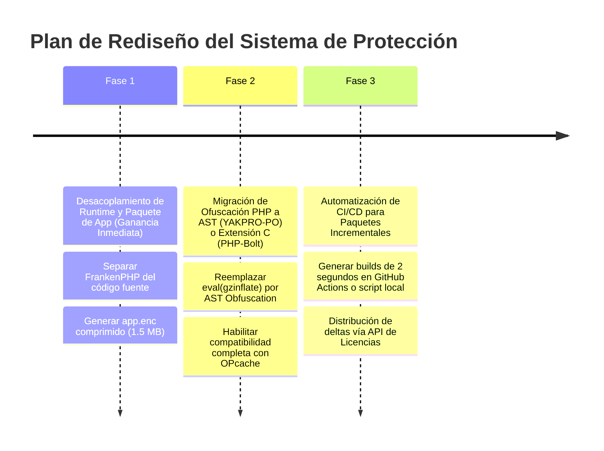

# Estrategia Recomendada y Plan de Implementación

Para eliminar los problemas de lentitud de build y descargas pesadas manteniendo un nivel de seguridad empresarial, se recomienda un plan de migración dividido en 3 fases progresivas.

---

## 1. Plan de Migración Recomendado

---

## 2. Detalle de Ejecución por Fases

### Fase 1: Desacoplamiento del Runtime (Resolución del Problema Inmediato)
* **Paso 1.1:** Compilar el binario ejecutable de FrankenPHP + `loader.cpp` una sola vez como **`SigmaGrav-Engine`**. Este binario incluirá las librerías de PHP, Caddy, Swoole y el sistema de licencias.
* **Paso 1.2:** Modificar `loader.cpp` para que, en lugar de descifrar un payload FrankenPHP estático embebido por `objcopy`, descargue o lea un paquete cifrado `app_payload.enc`.
* **Paso 1.3:** `loader.cpp` montará `app_payload.enc` en una carpeta en memoria RAM (`tmpfs` en `/tmp/sigmagrav_app` o mediante un file descriptor) y ejecutará FrankenPHP apuntando a esa carpeta.
* **Resultado:** El tiempo de compilación para lanzar una nueva versión de software pasa de **15 minutos a menos de 5 segundos**. El paquete de actualización que descarga el cliente mide **~1.5 MB**.

### Fase 2: Mejora de la Protección del Código PHP y JS
* **Backend:** Sustituir la función `ofuscar_archivo_individual` de `start_embed.sh` (basada en regex y `eval`) por **YAKPRO-PO** o por la extensión C **PHP-Bolt**. Esto protegerá el código contra des-ofuscación trivial y aumentará el rendimiento de Laravel al permitir el uso de OPcache.
* **Frontend:** Mantener `javascript-obfuscator` ajustando la configuración de mangle y obfuscación de strings para garantizar que la lógica de React siga protegida sin afectar la velocidad del bundle.

### Fase 3: Integración con la API de Licencias y Updates
* Actualizar el endpoint `/api/v1/license/renew` de `loader.cpp` para que retorne también el hash de la última versión disponible de `app_payload.enc`.
* Si la versión local difiere, `loader.cpp` descarga en segundo plano el nuevo paquete cifrado de 1.5 MB y reinicia suavemente el proceso de FrankenPHP.

---

## 3. Checklist de Verificación para Desarrolladores e IA

- [ ] ¿El binario `SigmaGrav-Engine` está desacoplado del código fuente de la app?
- [ ] ¿El paquete de actualización de la app pesa menos de 5 MB?
- [ ] ¿La validación por hardware (HWID) en `loader.cpp` sigue activa?
- [ ] ¿Se eliminó la instrucción `eval(gzinflate(...))` para habilitar OPcache en PHP?
- [ ] ¿El cliente descarga únicamente deltas cifrados durante las actualizaciones?
