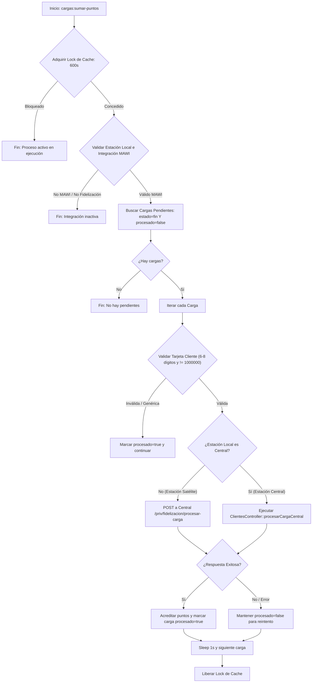

# Comando `cargas:sumar-puntos` (Procesamiento de Puntos de Fidelización)

Este documento detalla el funcionamiento interno, arquitectura, flujo de ejecución y configuración del comando de consola `php artisan cargas:sumar-puntos` en el backend de **SigmaGrav**.

---

## 1. Descripción General

El comando `cargas:sumar-puntos` (implementado en [SumarPuntosDesdeCarga.php](file:///home/burger/workspace/repos/SigmaGrav/SigmaGrav-BackEnd/app/Console/Commands/SumarPuntosDesdeCarga.php)) es un proceso en segundo plano encargado de leer las cargas de combustible finalizadas desde surtidores concentradores (**MAWI**), validar la tarjeta de fidelización asociada y acreditar los puntos correspondientes a la tarjeta del cliente en el servidor central.



---

## 2. Programación y Programación de Tareas (`routes/console.php`)

El comando está programado para ejecutarse en alta frecuencia a través del scheduler de Laravel en [routes/console.php](file:///home/burger/workspace/repos/SigmaGrav/SigmaGrav-BackEnd/routes/console.php):

```php
Schedule::command('cargas:sumar-puntos')
    ->everyTwoSeconds()
    ->when(fn() => ScheduledTask::isActive('cargas:sumar-puntos'))
    ->withoutOverlapping()
    ->onSuccess(function () {
        ScheduledTask::where('command', 'cargas:sumar-puntos')->update([
            'last_run_at' => now(),
            'last_run_status' => 'success'
        ]);
    })
    ->onFailure(function () {
        ScheduledTask::where('command', 'cargas:sumar-puntos')->update([
            'last_run_at' => now(),
            'last_run_status' => 'failed'
        ]);
    });
```

### Características clave del agendamiento:
* **Frecuencia**: Cada 2 segundos (`everyTwoSeconds()`).
* **Control Dinámico**: Se activa/desactiva mediante la tabla `scheduled_tasks` (`ScheduledTask::isActive('cargas:sumar-puntos')`).
* **Prevención de Traslape**: Combina `withoutOverlapping()` de Laravel con un bloqueo atómico en Redis/Cache (`Cache::lock('sumar_puntos_desde_carga_lock', 600)`).
* **Trazabilidad de Ejecución**: Registra timestamp (`last_run_at`) y estado (`success` o `failed`) en la base de datos.

---

## 3. Precondiciones de Integración (Estación Local)

Antes de buscar o procesar registros, el comando verifica la configuración de la estación local en la tabla `estaciones`:

1. Consulta la estación donde `local = true`.
2. Lee el campo JSON `otros['integracion_surtidores']`.
3. Requisitos para continuar:
   * `tipo` === `'mawi'`
   * `subtipo` en `['Concentrador y Fidelizacion', 'Fidelizacion']`

Si la estación no cumple estas condiciones, el comando emite un mensaje informativo y finaliza con código `0` sin tocar ningún registro.

---

## 4. Validación de Tarjeta y Selección de Cargas

El comando obtiene los registros de la tabla `cargas` que cumplen:
* `estado = 'fin'`
* `procesado = false`

Para cada carga, valida la propiedad `tarjeta_cliente`:
* **Formato Válido**: Debe ser numérico de 6 a 8 dígitos (`/^\d{6,8}$/`).
* **Tarjetas Omitidas / Genéricas**: Tarjetas vacías o la tarjeta genérica de contado (`1000000`).

Si la tarjeta es inválida o genérica, la carga se marca inmediatamente como `procesado = true` para evitar que vuelva a ser consultada en futuros ciclos.

---

## 5. Arquitectura Central vs. Satélite

### 5.1 En Estaciones Satélite (`central = false`)
Si la estación actual es una sucursal/estación de servicio física:
1. Busca la estación central activa (`central = true`, `activo = true`).
2. Utiliza `ComunicacionInternaService` para realizar un POST al endpoint de la central:
   * **Endpoint**: `/priv/fidelizacion/procesar-carga`
   * **Payload**: `{ "numero": tarjeta_cliente, "volumen": volumen, "manguera": manguera }`
3. Si la central responde `success = true`, actualiza `cargas.procesado = true`, guardando también en la tabla `cargas` los M3 consumidos (`m3ant` y `m3reg`).
4. Si ocurre un error HTTP o de red, **NO** marca la carga como procesada, permitiendo que el siguiente ciclo (2 segundos después) reintente la sincronización.

### 5.2 En el Servidor Central (`central = true`)
Si el comando corre directamente en la estación central, invoca la lógica de negocio ejecutando [ClientesController::procesarCargaCentral](file:///home/burger/workspace/repos/SigmaGrav/SigmaGrav-BackEnd/app/Http/Controllers/Api/V1/priv/ClientesController.php#L464):

1. **Obtención / Alta Externa de Tarjeta**:
   * Consulta la tarjeta en `fidelizacion_tarjetas`.
   * Si no existe localmente, consulta la API de MAWI (`APImawionlygetdata`). Si existe en MAWI, registra automáticamente el cliente y la tarjeta en el servidor central.
2. **Sincronización y Registro de Consumos M3**:
   * Compara los M3 Anticipados y Regalo devueltos por la API de MAWI con la base local.
   * Si detecta consumos o inconsistencias, genera un movimiento de trazabilidad en `fidelizacion_movimientos` (tipo `CONSUMO` o `ERROR_SINCRONIZACION`) y retorna en la respuesta los deltas consumidos (`m3ant` y `m3reg`).
3. **Cálculo de Puntos**:
   * Identifica el tipo de combustible desde la manguera mediante la tabla `aforadores`.
   * Busca la equivalencia de puntos en `fidelizacion_config` (`tipo = 'PUNTOS'`, `valor = tipocombustible`). Si no la encuentra, utiliza la regla por defecto (`valor = 'OTROS'`).
   * Calcula los puntos: `puntos_sumados = puntaje_unitario * volumen`.
4. **Acreditación y Registro en Carga**:
   * Suma los puntos al saldo de la tarjeta (`fidelizacion_tarjetas.puntos += puntos_sumados`).
   * Marca la carga local como `procesado = true` y registra los M3 consumidos (`m3ant` y `m3reg`) en la tabla `cargas`.

---

## 6. Monitoreo y Pruebas

### Ejecución Manual
Para ejecutar el comando manualmente desde la consola:
```bash
php artisan cargas:sumar-puntos
```

### Pruebas Automatizadas
El comportamiento del comando está cubierto por pruebas automatizadas en [SumarPuntosDesdeCargaTest.php](file:///home/burger/workspace/repos/SigmaGrav/SigmaGrav-BackEnd/tests/Feature/SumarPuntosDesdeCargaTest.php):
```bash
php artisan test --filter=SumarPuntosDesdeCargaTest
```
