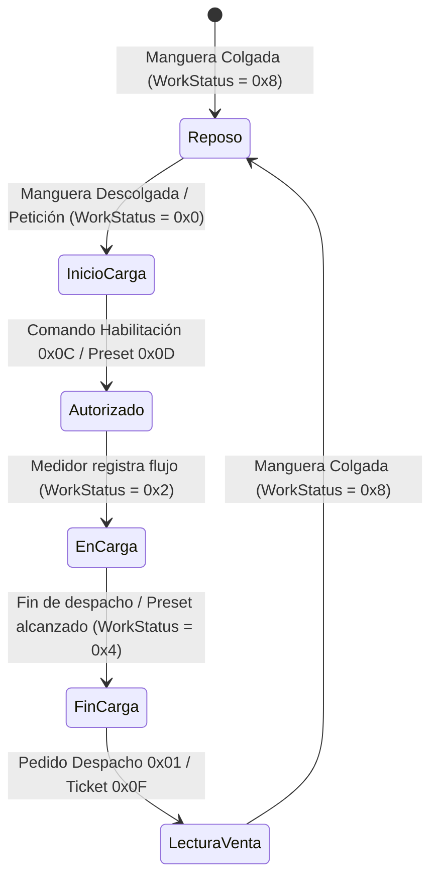

# Análisis Técnico y Especificación del Protocolo de Comunicación RS-485 para Surtidores y Cabezales Electrónicos Develco (SMC-1100 / Flowmetek)

## Contexto Técnico y Arquitectura Electrónica del Cabezal Electrónico Develco SMC-1100

Los cabezales electrónicos modelo **SMC-1100** (pertenecientes a la serie SMC-1000) desarrollados por **Develco® Diseños Industriales / Flowmetek S.A.** representan una de las arquitecturas de control centralizado más difundidas en el mercado latinoamericano para el despacho, medición y control de Gas Natural Comprimido (GNC) y combustibles líquidos.

La arquitectura de control centralizada del SMC-1100 administra las señales de los transductores de masa / flujo volumétrico, gobierna las electroválvulas de habilitación y etapas de corte de presión (alta, media, baja en GNC), controla las pantallas de indicación digital (importe, volumen y precio unitario) y expone una interfaz serie estándar RS-485 diferencial destinada al gobierno remoto desde sistemas concentradores de pista (*Forecourt Controllers* - FCC) y terminales punto de venta (POS).

| **Parámetro del Equipo** | **Especificación Técnica** |
| --- | --- |
| **Fabricante / Entidad Distribuidora** | Develco® Diseños Industriales / Flowmetek S.A. |
| **Modelos de Cabezal Principal** | Serie SMC-1000 / Modelo SMC-1100 (Firmware v1.7 R26 / v1.8 - DOC-TE-122) |
| **Periféricos de Pista** | Teclado de configuración SMC-1106-K |
| **Aplicación Principal** | Surtidores / Dispensadores de GNC y Combustibles Líquidos |
| **Configuración Hidráulica / Neumática** | 1 o 2 Líneas / Mangueras de Carga Independientes |
| **Capa Física de Comunicación** | RS-485 Diferencial Semidúplex (2 o 3 hilos) |
| **Protocolo Lógico** | Protocolo Propietario Develco SMC (Binario / ASCII) |
| **Control de Integridad** | Checksum Suma Módulo 256 ($\sum \text{Bytes} \pmod{256}$) |

---

## Capa Física e Interfaz de Comunicación RS-485

La comunicación serie entre el computador concentrador maestro de la estación de servicio y los surtidores equipados con cabezal Develco SMC-1100 se realiza mediante un bus asíncrono RS-485 diferencial semidúplex (*Half-Duplex*). La interfaz física utiliza conductores activos balanceados (líneas A y B) acompañados opcionalmente por una referencia de masa común (GND) para estabilizar voltajes de modo común en el bus.

El estándar de transmisión opera con niveles de tensión diferencial EIA/TIA-485 ($\Delta V_{AB} > +200\text{ mV}$ para '1' lógico y $\Delta V_{AB} < -200\text{ mV}$ para '0' lógico). La velocidad de transmisión por defecto en fábrica está fijada en **4800 baudios**, con un formato de carácter compuesto por 8 bits de datos, paridad par (*Even Parity*) y 2 bits de parada (*Stop Bits*).

| **Parámetro Serial** | **Especificación Estándar Develco SMC-1100** |
| --- | --- |
| **Velocidad de Transmisión (Baud Rate)** | 4800 bps (Configuración Estándar de Fábrica) |
| **Bits de Datos** | 8 bits |
| **Paridad** | Par (*Even Parity* - E) |
| **Bits de Parada (Stop Bits)** | 2 bits (8-E-2) |
| **Esquema de Red** | Bus multipunto Maestro-Esclavo (hasta 999 surtidores lógicos) |
| **Direccionamiento** | 3 Bytes ASCII en campo `ADDRESS` (`001` a `999`) |

---

## Configuración de Capa de Enlace y Enmarcado Serial

El protocolo Develco opera bajo un esquema estricto **Maestro-Esclavo mediante Sondeo Cíclico** (*Master-Slave Polling*):
1. **El Concentrador Host es el Maestro:** Es la única entidad facultada para iniciar la transmisión enviando un mensaje de "Pregunta" (Pedido de Información, Seteado o Control).
2. **El Surtidor es el Esclavo:** Nunca inicia una transmisión por iniciativa propia. Responde únicamente tras recibir un mensaje válido dirigido a su dirección `ADDRESS`.
3. **Gestión de Errores y Timeouts:** El Host debe implementar un tiempo de espera (*timeout*) de aproximadamente $1.0\text{ s}$. Si dentro del timeout no recibe respuesta o recibe una trama corrupta (fallo de Checksum), debe reintentar hasta un máximo de 3 veces antes de declarar fuera de línea (*Offline*) la posición. Si el surtidor detecta un error de Checksum o de sintaxis, ignora la trama y no responde.

---

## Estructura del Protocolo y Enmarcado de Tramas

Todos los mensajes transmitidos en la red (tanto desde la Host hacia el Surtidor como viceversa) poseen un formato unificado compuesto por 4 campos principales:

$$
\text{Trama Develco} = [\text{HEADER}] + [\text{ADDRESS}] + [\text{DATA}] + [\text{CHECKSUM}]
$$

```text
+-------------------+----------------------+------------------------+--------------------+
|  HEADER (1 Byte)  |  ADDRESS (3 Bytes)   |     DATA (N Bytes)     | CHECKSUM (1 Byte)  |
|   Hex Identif.    | ASCII ("001"-"999")  | Payload según Mensaje  | Suma Mód. 256      |
+-------------------+----------------------+------------------------+--------------------+
```

### Descripción de los Campos:

1. **`HEADER` (1 Byte Binario/Hexadecimal):**
   Es el primer byte del mensaje e identifica de manera unívoca el tipo de comando u operación. La longitud total de la trama queda definida por el tipo de `HEADER` y el sentido de transmisión.

2. **`ADDRESS` (3 Bytes ASCII):**
   Corresponde a los caracteres ASCII de las centenas, decenas y unidades de la dirección del surtidor (ejemplo: `'0'`, `'0'`, `'1'` para el surtidor 1; `'0'`, `'2'`, `'3'` para el surtidor 23). El rango válido comprende de `001` a `999`.

3. **`DATA` (Variable, de 0 a N Bytes):**
   Campo payload de longitud variable que transporta parámetros de configuración, lecturas de volumen, montos monetarios o estados del surtidor, codificados en ASCII o binario según el comando. Si la trama no requiere datos adicionales, este campo adopta longitud cero.

4. **`CHECKSUM` (1 Byte Binario):**
   Es el último byte de la trama y corresponde a la suma aritmética en Módulo 256 de todos los bytes precedentes del mensaje (`HEADER` + `ADDRESS` + `DATA`).

---

## Catálogo Completo de Mensajes y Comandos

El protocolo clasifica sus mensajes en tres categorías desde la Host hacia el Surtidor: **Pedidos de Información**, **Mensajes de Seteado** y **Mensajes de Control**; y dos categorías de respuesta desde el Surtidor hacia la Host: **Respuestas con Información** y **Respuestas de Confirmación (ACK/NACK)**.

### Tabla de Referencia Rápida de Comandos

| Header (Hex) | Dirección | Nombre del Mensaje (Host $\rightarrow$ Surtidor) | Long. Host | Nombre del Mensaje (Surtidor $\rightarrow$ Host) | Long. Surtidor |
| :---: | :---: | --- | :---: | --- | :---: |
| **`00`** | Host $\rightarrow$ Surt. | Pedido de Configuración | 5 | Mensaje de Configuración | 67 |
| **`1D`** | Host $\rightarrow$ Surt. | Pedido de Configuración Ampliado | 5 | Mensaje de Configuración Ampliado | 67 |
| **`01`** | Host $\rightarrow$ Surt. | Pedido de Despacho | 5 | Mensaje de Despacho | 27 |
| **`12`** | Host $\rightarrow$ Surt. | Pedido de Despacho Extendido | 5 | Mensaje de Despacho Extendido | 35 |
| **`0F`** | Host $\rightarrow$ Surt. | Pedido de Ticket | 6 | Mensaje de Ticket | 26 |
| **`02`** | Host $\rightarrow$ Surt. | Pedido de Status (Polling Estándar) | 5 | Mensaje de Status | 10 |
| **`17`** | Host $\rightarrow$ Surt. | Pedido de Status Extendido | 5 | Mensaje de Status Extendido | 26 |
| **`1E`** | Host $\rightarrow$ Surt. | Pedido de Status Ampliado | 5 | Mensaje de Status Ampliado | 30 |
| **`10`** | Host $\rightarrow$ Surt. | Pedido de PSC (Precio, Status, Carga) | 5 | Mensaje de PSC | 33 |
| **`16`** | Host $\rightarrow$ Surt. | Pedido de Totales Extendido | 6 | Mensaje de Totales Extendido | 22 |
| **`14`** | Host $\rightarrow$ Surt. | Pedido Información de Carga | 6 | Mensaje Información de Carga | 18 |
| **`15`** | Host $\rightarrow$ Surt. | Pedido Información de Premio | 6 | Mensaje Información de Premio | 13 |
| **`03`** | Host $\rightarrow$ Surt. | Reset Parciales 1 | 5 | Mensaje de Confirmación (ACK/NACK) | 6 |
| **`04`** | Host $\rightarrow$ Surt. | Reset Parciales 2 | 5 | Mensaje de Confirmación (ACK/NACK) | 6 |
| **`05`** | Host $\rightarrow$ Surt. | Set Totales 1 *(Uso exclusivo fábrica)* | 17 | Mensaje de Confirmación (ACK/NACK) | 6 |
| **`06`** | Host $\rightarrow$ Surt. | Set Totales 2 *(Uso exclusivo fábrica)* | 17 | Mensaje de Confirmación (ACK/NACK) | 6 |
| **`1C`** | Host $\rightarrow$ Surt. | Set Totales Extendido *(Uso fábrica)* | 22 | Mensaje de Confirmación (ACK/NACK) | 6 |
| **`07`** | Host $\rightarrow$ Surt. | Set Densidad | 9 | Mensaje de Confirmación (ACK/NACK) | 6 |
| **`08`** | Host $\rightarrow$ Surt. | Set Precio por $m^3$ / Litro | 9 | Mensaje de Confirmación (ACK/NACK) | 6 |
| **`09`** | Host $\rightarrow$ Surt. | Set Address (Dirección Lógica) | 8 | Mensaje de Confirmación (ACK/NACK) | 6 |
| **`0A`** | Host $\rightarrow$ Surt. | Set Hora | 7 | Mensaje de Confirmación (ACK/NACK) | 6 |
| **`0B`** | Host $\rightarrow$ Surt. | Set Fecha | 8 | Mensaje de Confirmación (ACK/NACK) | 6 |
| **`0E`** | Host $\rightarrow$ Surt. | Set Reset | 5 | Mensaje de Confirmación (ACK/NACK) | 6 |
| **`11`** | Host $\rightarrow$ Surt. | Set FCC (Factor de Calibración) | 11 | Mensaje de Confirmación (ACK/NACK) | 6 |
| **`13`** | Host $\rightarrow$ Surt. | Set Rango | 6 | Mensaje de Confirmación (ACK/NACK) | 6 |
| **`1A`** | Host $\rightarrow$ Surt. | Inicialización de Carga / Premio | 6 | Mensaje de Confirmación (ACK/NACK) | 6 |
| **`19`** | Host $\rightarrow$ Surt. | Configuración SOPA | 13 | Mensaje de Confirmación (ACK/NACK) | 6 |
| **`1B`** | Host $\rightarrow$ Surt. | Set Premio | 6 | Mensaje de Confirmación (ACK/NACK) | 6 |
| **`0C`** | Host $\rightarrow$ Surt. | Habilitación de Líneas (Autorizar) | 6 | Mensaje de Confirmación (ACK/NACK) | 6 |
| **`0D`** | Host $\rightarrow$ Surt. | Límite de Importe (Predeterminación) | 11 | Mensaje de Confirmación (ACK/NACK) | 6 |
| **`18`** | Host $\rightarrow$ Surt. | Desautorización de Líneas (Parada) | 7 | Mensaje de Confirmación (ACK/NACK) | 6 |

---

## Especificación Detallada de Comandos Principales

### 1. Pedido de Status (`Header 0x02`)
Es la trama de sondeo (*polling*) principal. La Host envía 5 bytes y el surtidor responde con 10 bytes detallando el estado de habilitación, trabajo y errores de cada línea.

- **Petición Host (5 bytes):** `0x02` + `ADDRESS(3 bytes ASCII)` + `CHECKSUM`
- **Respuesta Surtidor (10 bytes):** `0x02` + `ADDRESS(3 bytes)` + `Enable_L1` + `Enable_L2` + `WorkStatus_L1` + `WorkStatus_L2` + `HardwareStatus` + `CHECKSUM`

#### Estructura del Byte de Estado de Trabajo (`WorkStatus_L1` / `WorkStatus_L2`):
El nibble alto (bits D7-D4) define el estado operativo de la manguera (*Work Status*), mientras que el nibble bajo (bits D3-D0) transporta el código de bandera de error (*Error Flag*):

- **Work Status (Nibble Alto):**
  - `0x0` (`0b`): **Comienzo de Carga** (Inicio de ciclo / Puesta a cero).
  - `0x2` (`2b`): **En Carga** (Despacho activo / Medidor registrando flujo).
  - `0x4` (`4b`): **Final de Carga** (Despacho concluido).
  - `0x8` (`8b`): **No en Carga** (Manguera colgada / Surtidor inactivo).

---

### 2. Pedido de Despacho (`Header 0x01`)
Permite recuperar los valores acumulados de importe y volumen del despacho en curso o finalizado.

- **Petición Host (5 bytes):** `0x01` + `ADDRESS(3 bytes ASCII)` + `CHECKSUM`
- **Respuesta Surtidor (27 bytes):**
  - Bytes 0-3: `Header (0x01)` + `ADDRESS (3 bytes ASCII)`
  - Bytes 4-9: Importe Despacho Línea 1 (6 dígitos ASCII)
  - Bytes 10-14: Volumen Despacho Línea 1 (5 dígitos ASCII, formato `000.00` a `999.99`)
  - Bytes 15-20: Importe Despacho Línea 2 (6 dígitos ASCII)
  - Bytes 21-25: Volumen Despacho Línea 2 (5 dígitos ASCII)
  - Byte 26: `CHECKSUM`

---

### 3. Habilitación de Líneas / Autorización (`Header 0x0C`)
Orden enviada por la Host para habilitar el bombeo/despacho en la manguera seleccionada.

- **Petición Host (6 bytes):** `0x0C` + `ADDRESS(3 bytes)` + `Byte_Habilitacion` + `CHECKSUM`
  - `Byte_Habilitacion`: Define la línea a habilitar (Línea 1, Línea 2 o ambas).
- **Respuesta Surtidor (6 bytes):** Trama de Confirmación (ACK `0x06` / NACK `0x15`).

---

### 4. Límite de Importe / Predeterminación (`Header 0x0D`)
Define un corte automático por monto monetario antes de autorizar la carga.

- **Petición Host (11 bytes):** `0x0D` + `ADDRESS(3 bytes)` + `Importe_Preset(6 dígitos ASCII)` + `Línea` + `CHECKSUM`
- **Respuesta Surtidor (6 bytes):** Trama de Confirmación (ACK `0x06` / NACK `0x15`).

---

### 5. Desautorización de Líneas / Parada (`Header 0x18`)
Orden de corte o cancelación remota de autorización.

- **Petición Host (7 bytes):** `0x18` + `ADDRESS(3 bytes)` + `Byte_Desautorizacion` + `Modo` + `CHECKSUM`
- **Respuesta Surtidor (6 bytes):** Trama de Confirmación (ACK `0x06` / NACK `0x15`).

---

### 6. Seteo de Precio por $m^3$ / Litro (`Header 0x08`)
Actualiza el precio unitario en la memoria del surtidor.

- **Petición Host (9 bytes):** `0x08` + `ADDRESS(3 bytes)` + `Precio_ASCII(4 dígitos)` + `Línea` + `CHECKSUM`
- **Respuesta Surtidor (6 bytes):** Trama de Confirmación (ACK `0x06` / NACK `0x15`).

---

## Mensajes de Confirmación del Surtidor (ACK / NACK)

Cuando el surtidor recibe un mensaje de **Seteado** o de **Control**, evalúa la consistencia de los datos y las condiciones de aceptación del equipo. Si la orden es aceptada, responde con un mensaje de confirmación positivo (**ACK**); si los parámetros son inválidos o la manguera se encuentra en un estado que prohíbe la orden, responde con una confirmación negativa (**NACK**).

```text
+-------------------+----------------------+-------------------+--------------------+
|  HEADER (1 Byte)  |  ADDRESS (3 Bytes)   |  ACK/NACK Byte    | CHECKSUM (1 Byte)  |
| Coincide c/ Petic.| ASCII ("001"-"999")  | 0x06 (ACK) / 0x15 | Suma Mód. 256      |
+-------------------+----------------------+-------------------+--------------------+
```

- **ACK (`0x06`):** Indica que la orden de seteo o control fue recibida, validada y aplicada con éxito.
- **NACK (`0x15`):** Indica rechazo de la orden debido a incompatibilidad con el estado operativo o error en el rango de los argumentos.

---

## Máquina de Estados Finita y Ciclo de Vida de la Transacción

El concentrador maestro de pista debe controlar el surtidor Develco SMC-1100 respetando la máquina de estados finita del equipo.



### Fases Operativas:
1. **Reposo (`WorkStatus = 0x8` / No en Carga):** Manguera en soporte. El Host realiza sondeo periódico de estado (`0x02`) o actualiza precios (`0x08`).
2. **Inicio / Solicitud (`WorkStatus = 0x0` / Comienzo de Carga):** El cliente descuelga la manguera. El surtidor reporta la llamada al Host.
3. **Autorización / Predeterminación:** El Host envía el comando de predeterminación (`0x0D`) si aplica, y la orden de Habilitación de Líneas (`0x0C`).
4. **Despacho (`WorkStatus = 0x2` / En Carga):** El surtidor abre válvulas y registra flujo. Las pantallas indican el avance del volumen y del dinero.
5. **Finalización (`WorkStatus = 0x4` / Final de Carga):** Se corta el flujo al alcanzar el preset o colgar la manguera.
6. **Cierre de Venta:** El Host lee los datos finales del despacho mediante `0x01` o `0x0F` (Ticket), registra la transacción y el surtidor retorna a Reposo.

---

## Algoritmo de Verificación Checksum e Implementación de Código

El checksum del protocolo Develco se define matemáticamente como la suma en Módulo 256 de todos los bytes contenidos en los campos `HEADER`, `ADDRESS` y `DATA`:

$$
\text{Checksum} = \left( \text{Header} + \sum_{i=0}^{2} \text{Address}[i] + \sum_{j=0}^{N-1} \text{Data}[j] \right) \pmod{256}
$$

### Ejemplo Numérico de Cálculo (Set Densidad a 0.7299 en Surtidor `023`):
- `HEADER` = `0x07`
- `ADDRESS` = `'0'` (`0x30`), `'2'` (`0x32`), `'3'` (`0x33`)
- `DATA` = `'7'` (`0x37`), `'2'` (`0x32`), `'9'` (`0x39`), `'9'` (`0x39`)
- **Suma Directa Hex:** $0x07 + 0x30 + 0x32 + 0x33 + 0x37 + 0x32 + 0x39 + 0x39 = 0x177$
- **Checksum Resultante:** $0x177 \pmod{256} = 0x77$

---

### Implementación de Referencia en C

```c
#include <stdio.h>
#include <string.h>
#include <stdint.h>

/**
 * Calcula el Checksum Módulo 256 del protocolo Develco SMC-1100.
 * @param packet Puntero al buffer de la trama completa.
 * @param length Longitud total del paquete (incluyendo el byte final de checksum).
 * @return Byte de Checksum calculado.
 */
uint8_t calculate_develco_checksum(const uint8_t *packet, size_t length) {
    uint32_t sum = 0;
    for (size_t i = 0; i < length - 1; i++) {
        sum += packet[i];
    }
    return (uint8_t)(sum % 256);
}

/**
 * Valida un paquete recibido desde un surtidor Develco.
 */
int validate_develco_packet(const uint8_t *packet, size_t length) {
    if (length < 5) return 0; // Longitud mínima (Header + Address 3B + Checksum)
    uint8_t expected_checksum = packet[length - 1];
    uint8_t computed_checksum = calculate_develco_checksum(packet, length);
    return (expected_checksum == computed_checksum);
}
```

---

### Implementación de Referencia en Python 3

```python
def calculate_develco_checksum(data_bytes: bytes) -> int:
    """
    Calcula el Checksum Módulo 256 sobre la secuencia de bytes
    (excluyendo el byte del checksum final).
    """
    return sum(data_bytes) % 256

def build_develco_frame(header: int, address: int, payload: bytes = b"") -> bytes:
    """
    Construye una trama completa del protocolo Develco SMC-1100.
    
    :param header: Byte de cabecera en entero (ej. 0x02 para Status)
    :param address: Dirección numérica del surtidor (1 a 999)
    :param payload: Bytes de datos adicionales
    :return: Trama de bytes lista para transmitir por RS-485
    """
    header_byte = bytes([header])
    address_bytes = f"{address:03d}".encode('ascii')
    
    body = header_byte + address_bytes + payload
    checksum_byte = bytes([calculate_develco_checksum(body)])
    
    return body + checksum_byte

def parse_develco_response(response_bytes: bytes) -> dict:
    """
    Verifica y decodifica una trama de respuesta recibida de un surtidor Develco.
    """
    if len(response_bytes) < 5:
        raise ValueError("Longitud de trama insuficiente para protocolo Develco")
        
    body = response_bytes[:-1]
    received_checksum = response_bytes[-1]
    computed_checksum = calculate_develco_checksum(body)
    
    if received_checksum != computed_checksum:
        raise ValueError(f"Error Checksum Develco: Recibido 0x{received_checksum:02X}, Calculado 0x{computed_checksum:02X}")
        
    header = response_bytes[0]
    address = response_bytes[1:4].decode('ascii', errors='ignore')
    payload = response_bytes[4:-1]
    
    return {
        "header": header,
        "address": address,
        "payload": payload,
        "valid": True
    }
```

---

## Conclusiones y Guía de Implementación para Concentradores

1. **Acondicionamiento Serie:** Configurar el puerto RS-485 del concentrador a **4800 bps, 8 bits de datos, Paridad Par (Even), 2 bits de parada (8-E-2)**.
2. **Esquema de Direccionamiento:** Utilizar siempre 3 caracteres ASCII para el campo `ADDRESS` (`001` a `999`).
3. **Control del Timing y Polling:** Sonder periódicamente con el comando Pedido de Status `0x02` a intervalos de 100 ms – 250 ms. Manejar un timeout de respuesta de 1.0 s con hasta 3 reintentos.
4. **Respuesta a Seteos/Control:** Evaluar los mensajes de confirmación ACK (`0x06`) y NACK (`0x15`) devueltos por el surtidor ante comandos de autorización (`0x0C`), predeterminación (`0x0D`), corte (`0x18`) o precios (`0x08`).
