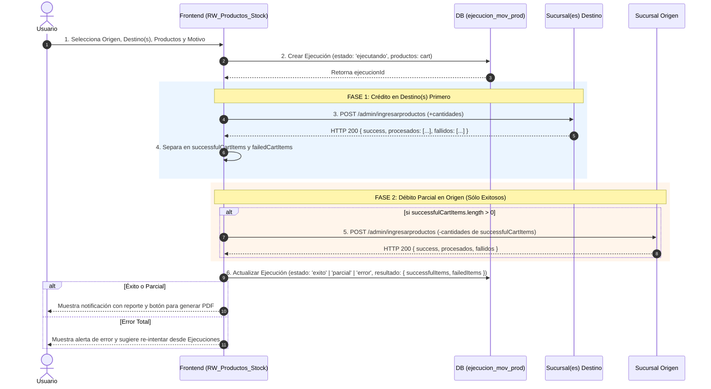
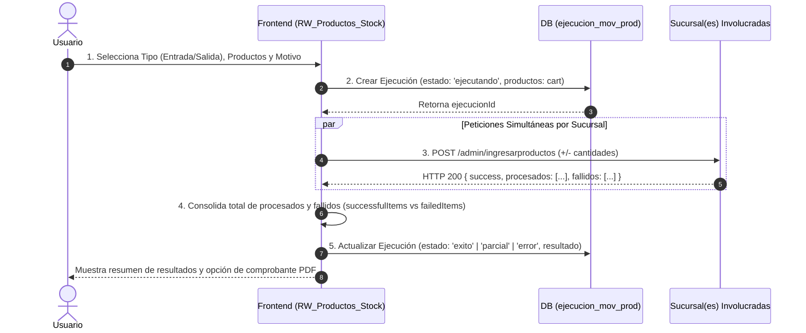

# Documentación Técnica: Flujos de Transferencia de Mercadería y Ajustes de Inventario

Esta documentación describe la arquitectura, la persistencia en base de datos, el manejo de errores sin fallos 500 y los diagramas de secuencia/flujo para los procesos de **Transferencia de Mercadería** y **Ajustes de Inventario (Entrada/Salida)** en el sistema SigmaGrav.

---

## 📌 Visión General de la Arquitectura

Los movimientos de inventario operan bajo una arquitectura cliente-servidor desacoplada. Toda operación masiva o por lotes se audita mediante la tabla `ejecucion_mov_prod`, garantizando que:
- Ningún fallo de servidor o de red pueda provocar inconsistencias silenciosas.
- Se pueda volver a generar el comprobante PDF oficial en cualquier momento.
- Se pueda re-ejecutar un lote fallido cargando **únicamente los productos que fallaron** en el carrito activo.

---

## 1. 🔄 Flujo de Transferencia de Mercadería

En una transferencia de mercadería entre sucursales/estaciones, la ejecución sigue un principio de **Crédito Primero a Destino** y **Débito Parcial posterior en Origen**.

### 📋 Pasos del Proceso:
1. **Inicio y Persistencia Inicial:** Se crea un registro en la tabla `ejecucion_mov_prod` con el estado `'ejecutando'`, guardando el carrito original y el motivo.
2. **Crédito en Destino(s) (Fase 1):** Se envían las peticiones de ingreso (`+qty`) a las sucursales de destino. El Backend procesa cada producto en un bloque `try/catch` individual y responde con HTTP 200 detallando dos arreglos: `procesados` y `fallidos`.
3. **Clasificación de Ítems:** El Frontend separa los productos en `successfulCartItems` (acreditados con éxito) y `failedCartItems` (aquellos que fallaron o cuya sucursal destino no respondió).
4. **Débito Parcial en Origen (Fase 2):** Se envía el débito (`-qty`) a la sucursal de origen **únicamente para los productos presentes en `successfulCartItems`**.
5. **Cierre y Auditoría:** Se actualiza la ejecución en `ejecucion_mov_prod` a `'exito'`, `'parcial'` o `'error'`, guardando la metadata completa.
6. **Re-ejecución:** Al presionar "Re-ejecutar" desde la pestaña de Ejecuciones, el carrito se puebla exclusivamente con los productos de `failedCartItems`.

### 📊 Diagrama de Flujo: Transferencia de Mercadería



---

## 2. ⚖️ Flujo de Ajustes de Inventario (Entrada / Salida)

Los ajustes por lote permiten incrementar (Entrada) o reducir (Salida) el stock en distintas sucursales simultáneamente.

### 📋 Pasos del Proceso:
1. **Inicio de Ejecución:** Registra la ejecución en `ejecucion_mov_prod` (`estado: 'ejecutando'`).
2. **Ejecución Paralela por Sucursal:** Agrupa los ítems por sucursal y envía peticiones simultáneas (`Promise.all`) con las cantidades firmadas (positivas para entradas, negativas para salidas).
3. **Protección Backend:** El método `ProductosController::ingresarProductos` procesa producto por producto y retorna el desglose de `procesados` y `fallidos` sin generar fallos 500 no controlados.
4. **Actualización de Historial:** Se actualiza la ejecución guardando los resultados por estación.

### 📊 Diagrama de Flujo: Ajustes por Lote (Entrada/Salida)



---

## 3. 🔁 Re-ejecución de Ajustes (Entrada/Salida) y Transferencias

**Sí, los ajustes de Entrada/Salida TAMBIÉN se pueden re-ejecutar.**

Al hacer clic en **"Re-ejecutar"** desde cualquier registro del Historial de Ejecuciones (pestaña *Ejecuciones*):
1. **Detección Automática de Tipo:** El sistema identifica si el registro es una `transferencia` o un `ajuste` (Entrada/Salida).
2. **Carga Inteligente de Fallidos:** 
   - Si la ejecución tuvo fallos parciales, **cargará únicamente los productos de `failedItems`** (los que fallaron al procesar en su sucursal).
   - Si fue una falla general o un lote limpio, cargará la lista completa de `productos`.
3. **Navegación Automática:** 
   - Si es `ajuste` $\rightarrow$ Carga los ítems en el carrito `adjustmentCart`, restablece el motivo y deriva al usuario a la pestaña **Entrada/Salida**.
   - Si es `transferencia` $\rightarrow$ Carga la estación origen y los ítems en `transferCart`, restableciendo la vista **Movimientos**.

---

## 4. 🗄️ Esquema de Base de Datos y Estructura de Respuesta

### Tabla `ejecucion_mov_prod`
| Campo | Tipo | Descripción |
| :--- | :--- | :--- |
| `id` | `bigint` (PK) | Identificador único de la ejecución |
| `tipo` | `varchar` | Tipo de operación (`transferencia` / `ajuste`) |
| `cuit_empleado` | `varchar` | DNI/CUIL del usuario autenticado que inició el lote |
| `motivo` | `varchar` | Motivo explicativo de la operación |
| `estacion_origen_id` | `varchar` | ID de la estación origen (para transferencias) |
| `estacion_origen_nombre`| `varchar` | Nombre de la estación origen |
| `productos` | `json` | Arreglo completo con los ítems agregados al carrito |
| `estado` | `enum` | Estado del lote (`ejecutando`, `exito`, `parcial`, `error`) |
| `resultado` | `json` | Objeto de auditoría con `successfulItems`, `failedItems`, respuestas y metadata de PDF |
| `timestamps` | `timestamp` | `created_at` y `updated_at` |
| `deleted_at` | `timestamp` | Eliminación lógica (*Soft Deletes*) |

### Estructura de Respuesta API Backend (`/admin/ingresarproductos`)
```json
{
  "success": true,
  "partial": false,
  "id": 1420,
  "procesados": [
    { "sku": "PROD001", "nombre": "Aceite 1L", "modulo": "Depósito", "sector": "A1", "cantidad": 5 }
  ],
  "fallidos": []
}
```

---

## 5. 🎨 Mejoras de Interfaz, Comprobantes PDF y Trazabilidad

### 5.1. Pestaña "Ejecuciones", Filtros de Búsqueda y Paginación
- **Filtros de Búsqueda en el Historial**:
  - **Filtro por Tipo**: Selector desplegable para filtrar ejecuciones por su tipo (`comprobante_proveedor` / *Ingreso Proveedor*, `entrada_salida` / *ENTRADA/SALIDA*, `transferencia` / *Transferencia*, `ajuste` / *Ajuste*). Por defecto se seleccionan "Todos".
  - **Filtro por Fecha y Hora (Desde / Hasta)**: Entradas de tipo `datetime-local` que permiten filtrar ejecuciones dentro de un rango específico de fecha y hora. Por defecto, el filtro **Desde** se inicializa en **1 mes atrás desde la hora actual** y **Hasta** en la **fecha/hora actual**.
  - **Botón Limpiar y Buscar**: Permite restablecer los filtros por defecto o forzar la actualización de los registros.
- **Paginación en Backend y Frontend**:
  - El backend (`EjecucionMovProdController::index`) recibe los parámetros `page`, `per_page`, `tipo`, `fecha_desde` y `fecha_hasta`, aplicando los filtros directamente en la consulta SQL (`created_at >= fecha_desde`, `created_at <= fecha_hasta`) y devolviendo una estructura paginada Laravel.
  - El frontend incluye una barra de paginación interactiva debajo de la tabla que permite navegar cómodamente entre las distintas páginas de ejecuciones registradas.
- **Normalización de Nombres de Tipo y Badges**:
  - `comprobante_proveedor`: Se visualiza con la etiqueta de texto **Ingreso Proveedor** y estilo distintivo.
  - `entrada_salida`: Se visualiza en las tablas y modales de detalle con la etiqueta en mayúsculas **ENTRADA/SALIDA**.
- **Optimización de Columnas:** Se eliminó la columna "Sucursal Origen" para evitar redundancias en la tabla principal.
- **Formateo de Motivo:** El texto del motivo en la tabla se limita a un máximo de **20 caracteres**, agregando puntos suspensivos (`...`) y manteniendo el texto completo en el atributo `title` para su lectura al pasar el cursor (tooltip).
- **Control de Re-ejecución y Vinculación de Éxito:**
  - El botón **"Re-ejecutar"** permanece deshabilitado para ejecuciones finalizadas con éxito (`'exito'`).
  - Cuando una ejecución `'parcial'` o con `'error'` es re-ejecutada y el nuevo intento finaliza con éxito, la ejecución de origen detecta el resultado favorable:
    - Deshabilita el botón de re-ejecución en la ejecución previa.
    - Despliega un distintivo verde **`Re-ejecutado en #ID`** indicando el número de ID de la nueva ejecución en que se completó.
- **Eliminación de Ejecuciones con ERROR:** En la columna de **Acciones**, los registros en estado `'error'` disponen del botón **Eliminar** (`<FaTrash />`) para remover intentos fallidos del historial con confirmación previa (`Swal.fire`).
- **Nombre de Empleado:** Se realiza la resolución del campo `cuit_empleado` contra los modelos `User` y `empleados` en el backend (`EjecucionMovProdController`), retornando `nombre_empleado` (Nombre + Apellido) para ser mostrado en la tabla e historial.
- **Tabla de Incidencias en Modal:** Se reemplazó el bloque técnico JSON por una tabla intuitiva de **Productos con Fallos / Incidencias**, con etiquetas que especifican el origen del fallo:
  - `Error al procesar en destino (Nombre Sucursal)`
  - `Error al descontar en origen (Nombre Sucursal)`

### 5.2. Emisión de Comprobantes PDF y Reporte de Movimientos
- **Títulos Personalizados según Tipo de Ejecución**:
  - `comprobante_proveedor` $\rightarrow$ **"Ejecucion Ingreso Comprobante Proveedor"**
  - `entrada_salida` $\rightarrow$ **"Ejecucion Entrada/Salida"**
  - `transferencia` $\rightarrow$ **"Ejecucion Transferencia de Mercaderia"**
- **Fecha/Hora Histórica:** Al regenerar un PDF desde el historial, el documento exhibe la fecha y hora exactas de ejecución original (`created_at`).
- **Identificación del Operador:** En la cabecera del PDF (campo `Usuario:`), se imprime el Nombre y Apellido completo del usuario en lugar del DNI/CUIL.
- **Resolución Inteligente CUIT/CUIL a DNI:** Si el operador posee un CUIT/CUIL de 11 dígitos (ej. `20403103978`), el backend extrae automáticamente el DNI de 8 dígitos (`40310397`) para resolver su Nombre y Apellido desde el modelo `User` (columna `dni`) o `empleados` (columna `cuil`). Se previenen además cadenas vacías o `"null null"`.
- **Stock Orientado a Destino en Transferencias:** Las columnas `STOCK ANT.` y `STOCK ACT.` en transferencias representan el stock de la **sucursal receptora (destino)** (stock previo y acumulado tras recibir las unidades).
- **Estructura de Columnas en Comprobantes:**
  $$\text{SKU} \quad | \quad \text{PRODUCTO} \quad | \quad \text{TIPO} \quad | \quad \text{DETALLE UBICACIÓN} \quad | \quad \mathbf{\text{CANTIDAD}} \quad | \quad \text{STOCK ANT.} \quad | \quad \text{STOCK ACT.}$$
- **Reporte de Movimientos de Stock Multi-Estación:**
  - Al seleccionar **"Todas las Estaciones"**, el frontend realiza peticiones simultáneas (`Promise.all`) a todos los endpoints de las estaciones habilitadas, consolidando, desduplicando y ordenando cronológicamente todo el historial.
  - Se agregó la columna **Estación** (`estacion_nombre`) en la plantilla PDF del Reporte de Movimientos, ubicada inmediatamente después de la columna **Fecha**.

### 5.3. Estandarización de Trazas de Producto (`trazaproductos`)
- En las transferencias de stock, tanto el registro de **crédito (+)** en el destino como el registro de **débito (-)** en el origen guardan la información simétrica:
  - **`movimiento`**: `"Movimiento"`
  - **`comentario`**: El motivo textual ingresado por el operador.
  - **`modulo_origen` / `modulo_destino`**: Contienen **únicamente el nombre del módulo** (ej. `"Remitente"`, `"Shop"`), omitiendo prefijos repetitivos de estación.
  - **`sector_origen` / `sector_destino`**: El sector correspondiente a cada punto del movimiento.

