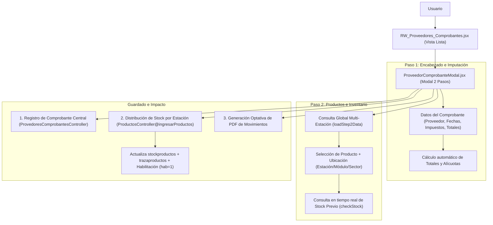

# Módulo de Carga y Gestión de Comprobantes de Proveedores - SigmaGrav

Este documento detalla la arquitectura, el flujo de datos, los componentes involucrados y la lógica de negocio del módulo de **Carga y Gestión de Comprobantes de Proveedores** en el sistema **SigmaGrav** (FrontEnd y BackEnd).

---

## 1. Visión General del Módulo

El módulo permite gestionar la facturación y documentación de compras enviada por proveedores (Facturas, Notas de Crédito, Notas de Débito, Remitos, Recibos), realizando:
* Registro contable e imputación financiera.
* Control de estados de pago (Pendiente, Pagado, etc.).
* **Actualización automática e inmediata del stock físico** en múltiples estaciones, módulos y sectores.
* Garantía de habilitación activa (`hab: 1`) para productos nuevos o existentes en el inventario.
* Auditoría de cambios y emisión de comprobantes PDF de movimientos de stock.



---

## 2. Archivos y Componentes Clave

| Componente / Archivo | Ubicación | Responsabilidad |
| :--- | :--- | :--- |
| **`RW_Proveedores_Comprobantes.jsx`** | `src/componentes/Cuerpos/remotework/submodulos/Proveedores/` | Vista principal con tabla paginada, filtros por estación/proveedor/fechas y acciones (nuevo/editar/eliminar). |
| **`ProveedorComprobanteModal.jsx`** | `src/componentes/Cuerpos/remotework/submodulos/Proveedores/` | Modal interactivo paso a paso para carga/edición de datos generales e ítems de productos. |
| **`PuenteApi.jsx`** | `src/pageauth/` | Capa de servicio FrontEnd para llamadas a API (`ObtenerComprobantesProveedor`, `CrearComprobanteProveedor`, `IngresarProductos`, etc.). |
| **`ProvedoresComprobantesController.php`** | `app/Http/Controllers/Api/V1/priv/` (BackEnd) | API Controller para guardar/editar comprobantes de proveedores y guardar historial de cambios. |
| **`ProductosController.php`** | `app/Http/Controllers/Api/V1/priv/` (BackEnd) | Endpoint `ingresarProductos`: incrementa stock, registra traza y asegura la estructura de `habilitacion` con `hab = 1`. |

---

## 3. Flujo Detallado de Carga de Comprobantes

### 3.1 Paso 1: Encabezado del Comprobante
El usuario completa los datos fiscales y contables del comprobante:

* **Datos Identificatorios**:
  * Razón Social (CUIT emisor) y Proveedor.
  * Imputación contable asignada.
  * Tipo de Comprobante (`Factura`, `Nota Credito`, `Nota Debito`, `Remito Proveedor`, `Recibo`).
  * Letra (`A`, `B`, `C`, `M`, `R`), Punto de Venta (4 dígitos) y Número (8 dígitos).
  * Fechas: Emisión, Vencimiento, Imputación y Pago.

* **Desglose de Montos e Impuestos**:
  * Neto Gravado y Neto No Gravado.
  * Descuentos Gravados y No Gravados.
  * Alícuotas de IVA (`21%`, `10.5%`, `27%`, `5%`, `2.5%`).
  * Percepciones (IIBB, IIBB Diferencial, Percepción IVA, Ganancias) e Impuestos Internos.
  * **Cálculo Automático**: La función `calculateTotal` recalcula automáticamente el total general en tiempo real ante cualquier cambio numérico.

* **Validación Financiera**:
  Si el estado se marca como **`Pagado`** y el tipo es **`Factura`**, el sistema emite una advertencia informando que se registrará la orden de pago correspondiente.

---

### 3.2 Paso 2: Asignación de Productos e Ingreso de Stock Multi-Estación
Al avanzar al Paso 2, el sistema activa la carga de inventario:

1. **Consulta Global (`loadStep2Data`)**:
   * Itera sobre todas las estaciones configuradas en el sistema.
   * Obtiene los **Módulos/Sectores** disponibles (`ObtenerModulosPorEndpoint`) excluyendo módulos de gestión administrativa.
   * Obtiene el catálogo de **Productos** por estación (`ObtenerProductosPorEndpoint`).
   * **Unificación Segura por SKU**: Consolida en memoria la lista de productos y sus habilitaciones entre estaciones sin corromper la estructura JSON `{ estaciones: [...] }`.

2. **Selección de Producto y Ubicación**:
   * El usuario selecciona o busca el producto por **SKU / Nombre / Código**.
   * Selecciona el destino físico: **Estación + Módulo + Sector**.
   * **Consulta de Stock Previo (`checkStock`)**: Al elegir producto y módulo/sector, invoca a `ObtenerStockProductoPorEndpoint` para mostrar en pantalla la cantidad física actual existente antes del ingreso.
   * Ingresa la **Cantidad a recibir** y presiona **Agregar Producto**.

---

### 3.3 Paso 3: Proceso de Guardado e Impacto Multinivel (`handleSubmit`)

Al confirmar el formulario, se ejecutan las siguientes acciones en secuencia:

#### A. Registro del Comprobante Central
1. Se construye el paquete de datos (`payload`) con la información del encabezado + la lista de `items`.
2. Se envía a la estación central mediante `agregarComprobanteProveedor`.
3. El servidor crea el registro en la tabla `provedores_comprobantes` y retorna el `id` asignado.

#### B. Distribución del Stock por Estación (`IngresarProductos`)
1. Los ítems agregados se agrupan por el `endpoint` de la estación a la que pertenecen (`itemsAgrupados`).
2. Por cada estación de destino, se envía una petición al endpoint `ingresarproductos` de la API de esa estación con:
   ```json
   {
     "productos": [ { "sku": "...", "cantidad": 10, "modulo": "Playa", "sector": "1" } ],
     "motivo": "INGRESO Comprobante",
     "id_comprobante": 1052,
     "transacciones_table": "comprobante_proveedor"
   }
   ```

3. **Ejecución en BackEnd (`ProductosController@ingresarProductos`)**:
   * **Búsqueda/Creación del Producto**: Busca el producto por `sku`. Si no existe en la base local de la estación, lo crea e inicializa automáticamente su columna JSON `habilitacion` garantizando `"hab": 1` para el módulo y sector receptor.
   * **Garantía de Habilitación**: Si el producto ya existía pero no poseía este módulo/sector en su objeto de habilitación, se añade la regla con `"hab": 1` para asegurar su disponibilidad en puntos de venta (POS).
   * **Actualización de Stock**: Incrementa la cantidad en la tabla `stockproductos` para esa combinación de `productos_id + modulo + sector`.
   * **Registro de Traza**: Inserta una fila en `trazaproductos` registrando el movimiento de ingreso, stock previo, stock posterior, usuario interviniente y la referencia al comprobante de proveedor.

#### C. Reporte PDF de Movimientos
Una vez finalizado el guardado, el sistema pregunta al usuario si desea emitir el reporte PDF. De ser afirmativo, invoca a `ReporteComprobanteMovimiento` en `GenerarPDF.jsx`, generando un documento impreso con el detalle del ingreso:
* SKU y Nombre del Producto.
* Ubicación de destino (`Estación - Módulo Sector`).
* Cantidad Ingresada.
* Stock Anterior vs. Stock Actual Resultante.

---

## 4. Edición e Historial de Modificaciones

Cuando se abre un comprobante en modo **Edición**:
* Se deshabilita el agregado de nuevos ítems de stock (solo editable en creación inicial).
* Se habilita la edición de campos de encabezado (Fechas, Importes, Estado, Observación).
* Al guardar cambios, la API compara el objeto original con el modificado y guarda una traza en la columna `historial_modificaciones` con la fecha, usuario y campos alterados.
* La interfaz UI resalta visualmente en color amarillo (`#fff3cd`) aquellos campos que hayan sido modificados históricamente.
