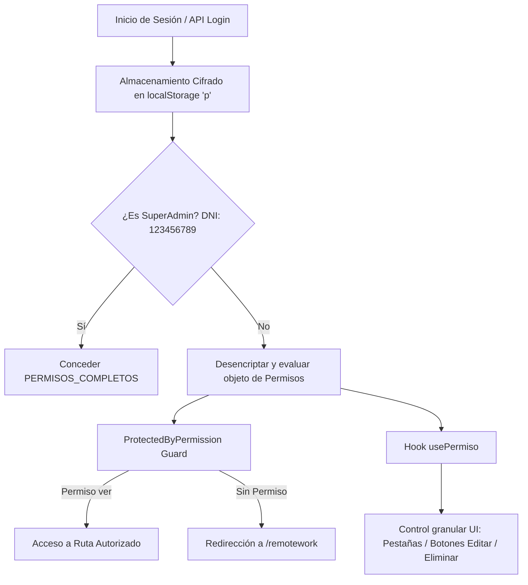

# Funcionamiento del Sistema de Permisos en SigmaGrav-FrontEnd

Este documento detalla el funcionamiento técnico y la arquitectura del sistema de permisos e itinerario de accesos del proyecto **SigmaGrav-FrontEnd**.

---

## 1. Arquitectura General del Sistema de Permisos

El sistema de permisos de SigmaGrav-FrontEnd maneja la autorización granular basada en módulos, submenús, acciones (`ver`, `editar`, `eliminar`) y pestañas/vistas internas (`vistas`). 

Además, implementa persistencia cifrada en cliente, exención por SuperAdmin y protección activa de rutas en React Router.



---

## 2. Componentes Principales y Responsabilidades

### 2.1 `PermisosService.js` ([src/services/PermisosService.js](file:///home/burger/workspace/repos/SigmaGrav/SigmaGrav-FrontEnd/src/services/PermisosService.js))
Es el motor central del sistema. Define la estructura de permisos, la lógica de desencriptado/encriptado y las funciones públicas de verificación.

#### Definiciones clave:
* **`SUPERADMIN_DNI`**: DNI maestro (`'123456789'`). Cualquier usuario logueado con este DNI omite las validaciones y obtiene acceso total automático (`PERMISOS_COMPLETOS`).
* **`MENU_STRUCTURE`**: Mapa estructurado de menús, submenús y vistas internas disponibles en la aplicación.
* **Cifrado AES (`CryptoJS`)**: Los permisos se leen (`getPermisos`) y guardan (`setPermisos`) en `localStorage` bajo la clave `'p'`, utilizando la clave secreta `process.env.REACT_APP_SECRET_KEY`.

#### Estrategia Granular y Compatibilidad Legacy:
El resolutor `resolveSubPermiso` permite retrocompatibilidad con versiones anteriores:
- **Estructura Nueva (Objeto)**: `{ ver: boolean, editar: boolean, eliminar: boolean, vistas: { [vista]: boolean } }`
- **Estructura Legacy (Boolean directos)**: Si el valor es `true`, se asume acceso total (`{ ver: true, editar: true, eliminar: true }`).

#### Funciones Principales:
| Función | Descripción |
| :--- | :--- |
| `tienePermisoVer(menu, submenu)` | Evalúa si el usuario puede acceder/ver la sección. Determina visibilidad en Sidebar y Route Guards. |
| `tienePermisoEditar(menu, submenu)` | Evalúa si el usuario tiene privilegios para crear/modificar registros. |
| `tienePermisoEliminar(menu, submenu)` | Evalúa si el usuario tiene privilegios para borrar registros. |
| `tienePermisoVista(menu, submenu, vista)` | Evalúa si el usuario puede ver una pestaña/subvista específica dentro de una sección. |
| `tieneAlgunPermisoEnMenu(menu)` | Verifica si el usuario tiene al menos un submenú visible para mostrar el grupo principal en el menú de navegación. |

---

### 2.2 Hook `usePermiso` ([src/hooks/usePermiso.js](file:///home/burger/workspace/repos/SigmaGrav/SigmaGrav-FrontEnd/src/hooks/usePermiso.js))
Hook personalizado para React que expone los permisos de un módulo de manera memorizada (`useMemo`) para su uso en componentes UI.

#### Firma del Hook:
```javascript
const { ver, editar, eliminar, tieneVista, esSuperAdmin } = usePermiso('modulo', 'submodulo');
```

#### Ejemplo de Uso en Componente:
```jsx
import usePermiso from '../../hooks/usePermiso';

const MiComponente = () => {
    const { editar, eliminar, tieneVista } = usePermiso('productos', 'administrar');

    return (
        <div>
            {tieneVista('estadisticas') && <EstadisticasComponent />}
            
            {editar && (
                <button onClick={handleEdit}>Editar Producto</button>
            )}
            
            {eliminar && (
                <button onClick={handleDelete}>Eliminar Producto</button>
            )}
        </div>
    );
};
```

---

### 2.3 `ProtectedByPermission.jsx` ([src/pageauth/ProtectedByPermission.jsx](file:///home/burger/workspace/repos/SigmaGrav/SigmaGrav-FrontEnd/src/pageauth/ProtectedByPermission.jsx))
Es el guard de navegación integrado con `react-router-dom` para el módulo `/remotework`.

#### Funcionamiento:
1. Mapea la ruta actual (`location.pathname`) mediante el diccionario `ROUTE_PERMISSIONS` hacia un par `{ menu, submenu }`.
2. Llama a `tienePermisoVer(menu, submenu)`.
3. Si la ruta requiere permiso y el usuario no cuenta con él, redirige automáticamente a `/remotework` (Panel de Inicio).
4. Si la ruta no está explícitamente restringida o el usuario cumple con los permisos, renderiza el `<Outlet />`.

---

### 2.4 Persistencia y Comunicación con Backend (`AuthUser.jsx` y `PuenteApi.jsx`)

* **`AuthUser.jsx`**: Al autenticar, recibe la propiedad `permisos` del backend y la guarda de forma cifrada mediante `setPermisos(permisos)`.
* **`PuenteApi.jsx`**: Proporciona endpoints para interactuar con el backend:
  * `verificarPermisoUsuario(operarioID, permiso)`: Verificación puntual directa en backend.
  * `ObtenerPermisosUsuario(endpoint, data)`: Consulta de permisos de un usuario específico.
  * `ActualizarPermisosUsuario(endpoint, data)`: Modificación de matriz de permisos desde la interfaz de administración.

---

## 3. Matriz de Estructura de Menús y Vistas (`MENU_STRUCTURE`)

El mapa formal de módulos y subvistas soportadas se organiza de la siguiente manera:

| Menú Principal | Submenú (`submenu`) | Vistas Granulares Internas (`vistas`) |
| :--- | :--- | :--- |
| **`personas`** | `clientes`, `usuarios`, `empleados` | N/A |
| **`proveedores`** | `administrar` | `estadisticas`, `reportes`, `proveedores`, `familias`, `comprobantes`, `pagos` |
| | `contable` | `estadisticas`, `reportes`, `comprobantes`, `pagos` |
| **`productos`** | `administrar` | `estadisticas`, `reportes`, `productos`, `combos`, `promociones`, `gondolas` |
| | `stock` | `estadisticas`, `reportes`, `stock`, `movimientos`, `ajustes` |
| **`combustibles`** | `combustibles` | `estadisticas`, `reportes`, `precios`, `agregar`, `fuga` |
| | `tanques` | `estadisticas`, `reportes`, `tanques`, `fuga` |
| **`playamini`** | `playa` | `estadisticas`, `reportes`, `cierres`, `transacciones`, `tiradas` |
| | `minimercado` | `estadisticas`, `reportes`, `cierres`, `transacciones`, `tiradas` |
| **`contable`** | `cobros` | `estadisticas`, `reportes`, `remitos` |
| | `pagos` | `estadisticas`, `reportes`, `gastos`, `ordenes`, `historial` |
| | `sueldos` | `gestion`, `estadisticas`, `reportes` |
| | `facturacion` | `estadisticas`, `reportes`, `facturar`, `nota_credito`, `nota_debito` |
| | `libros` | N/A |
| | `ajustes` | `iibb`, `actividad`, `imputaciones` |
| **`fidelizacion`**| `tarjetas` | N/A |
| | `premios` | `administracion`, `tipos`, `estadisticas`, `reportes` |
| | `venta_anticipada` | `estadisticas`, `reportes`, `administracion` |
| **`configuracion`**| `modulos`, `razonessociales`, `posapp`, `estaciones`, `runners` | N/A |

---

## 4. Buenas Prácticas al Agregar Nuevas Rutas o Pestañas

> [!IMPORTANT]
> Cada vez que se cree una nueva sección o vista en el FrontEnd, se deben seguir los siguientes pasos para mantener la coherencia del sistema de permisos:

1. **Registrar en `MENU_STRUCTURE`**: En [src/services/PermisosService.js](file:///home/burger/workspace/repos/SigmaGrav/SigmaGrav-FrontEnd/src/services/PermisosService.js), agregar el submenú o la vista bajo el menú correspondiente.
2. **Proteger la Ruta en React Router**: En [src/pageauth/ProtectedByPermission.jsx](file:///home/burger/workspace/repos/SigmaGrav/SigmaGrav-FrontEnd/src/pageauth/ProtectedByPermission.jsx), agregar la ruta en `ROUTE_PERMISSIONS`.
3. **Consumir `usePermiso` en el Componente**: Usar el hook `usePermiso` para condicionar los elementos de interacción en la vista (pestañas, botones de acción, modales de edición/eliminación).
