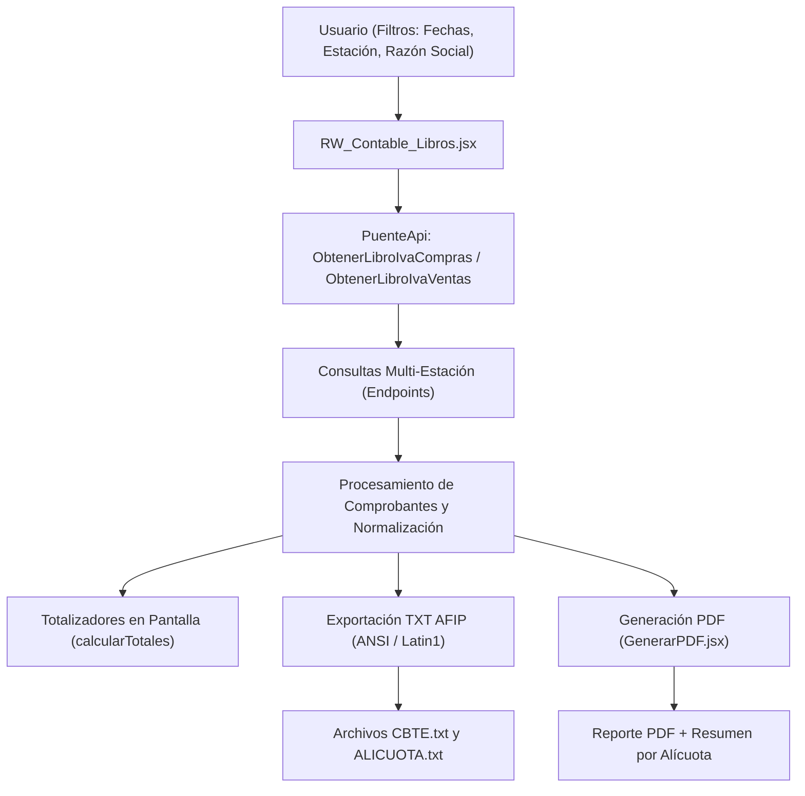

# Módulo Libro IVA Digital (Contable) - SigmaGrav-FrontEnd

Este documento detalla el funcionamiento técnico, la arquitectura, los algoritmos de cálculo y los procesos de exportación del módulo **Libro IVA Digital** (Compras y Ventas) para AFIP/ARCA en el proyecto **SigmaGrav-FrontEnd**.

---

## 1. Arquitectura General y Componentes

El módulo permite la consulta, visualización, totalización y exportación (tanto en PDF como en formato TXT oficial para la importación en ARCA/AFIP) del Libro IVA Compras e IVA Ventas, soportando consultas multi-estación.



---

## 2. Archivos Principales y Responsabilidades

### 2.1 `RW_Contable_Libros.jsx`
* **Ubicación**: [src/componentes/Cuerpos/remotework/submodulos/Contable/RW_Contable_Libros.jsx](file:///home/burger/workspace/repos/SigmaGrav/SigmaGrav-FrontEnd/src/componentes/Cuerpos/remotework/submodulos/Contable/RW_Contable_Libros.jsx)
* **Función**: Componente de interfaz de usuario donde se seleccionan los filtros, se recuperan los comprobantes desde los endpoints de cada estación, se muestran los totales en pantalla y se gatillan las exportaciones en TXT o PDF.

### 2.2 `GenerarPDF.jsx`
* **Ubicación**: [src/componentes/Cuerpos/submoduloscomunes/GeneradorPdf/GenerarPDF.jsx](file:///home/burger/workspace/repos/SigmaGrav/SigmaGrav-FrontEnd/src/componentes/Cuerpos/submoduloscomunes/GeneradorPdf/GenerarPDF.jsx)
* **Función**: Motor generador de documentos PDF (vía `pdfmake`). Contiene las funciones `ReporteLibroIvaDigitalCompras` y `ReporteLibroIvaDigitalVentas`, encargadas de compilar el listado detallado y generar el cuadro de **RESUMEN POR ALÍCUOTA**.

---

## 3. Mapeo de Comprobantes AFIP/ARCA

Para el cálculo de totales y la exportación de archivos oficiales, cada comprobante del sistema se mapea a su correspondiente código de tipo de comprobante de AFIP mediante la clave `${tipo}-${letra}`:

| Tipo + Letra | Código AFIP | Signo de Impacto |
| :--- | :---: | :---: |
| `Factura-A` | `001` | `+1` (Suma) |
| `Nota Debito-A` / `Nota de Débito-A` | `002` | `+1` (Suma) |
| **`Nota Credito-A` / `Nota de Crédito-A`** | **`003`** | **`-1` (Resta)** |
| `Recibo-A` | `004` | `+1` (Suma) |
| `Factura-B` | `006` | `+1` (Suma) |
| `Nota Debito-B` / `Nota de Débito-B` | `007` | `+1` (Suma) |
| **`Nota Credito-B` / `Nota de Crédito-B`** | **`008`** | **`-1` (Resta)** |
| `Recibo-B` | `009` | `+1` (Suma) |
| `Factura-C` | `011` | `+1` (Suma) |
| `Nota Debito-C` / `Nota de Débito-C` | `012` | `+1` (Suma) |
| **`Nota Credito-C` / `Nota de Crédito-C`** | **`013`** | **`-1` (Resta)** |
| `Recibo-C` | `015` | `+1` (Suma) |
| `Factura-M` | `051` | `+1` (Suma) |
| `Nota Debito-M` / `Nota de Débito-M` | `052` | `+1` (Suma) |
| **`Nota Credito-M` / `Nota de Crédito-M`** | **`053`** | **`-1` (Resta)** |
| `Factura-E` | `019` | `+1` (Suma) |
| `Nota Debito-E` / `Nota de Débito-E` | `020` | `+1` (Suma) |
| **`Nota Credito-E` / `Nota de Crédito-E`** | **`021`** | **`-1` (Resta)** |

> [!IMPORTANT]
> **Notas de Crédito**: Los tipos de comprobante con códigos `['003', '008', '013', '053', '021']` se definen en la constante `NOTAS_CREDITO_TIPOS`. Estos comprobantes aplican un multiplicador de `signo = -1`, por lo cual sus importes se **restan** automáticamente de todos los acumuladores (pantalla, PDF y archivos de exportación).

---

## 4. Reglas de Cálculo de Recuadros (Pantalla Web)

En `RW_Contable_Libros.jsx`, la función `calcularTotales` itera sobre el arreglo de comprobantes cargados para calcular los recuadros principales:

```javascript
const calcularTotales = () => {
    let totalGeneral = 0;
    let totalIva = 0;
    let totalNeto = 0;
    let totalNoGravado = 0;

    comprobantes.forEach(comp => {
        const codigoTipo = getCodigoTipoAfip(comp.tipo, comp.letra);
        const esNc = NOTAS_CREDITO_TIPOS.includes(codigoTipo);
        const signo = esNc ? -1 : 1;

        totalGeneral   += (Number(comp.total) || 0) * signo;
        totalIva       += ((Number(comp.iva21) || 0) + (Number(comp.iva10_5) || 0) + (Number(comp.iva27) || 0) + (Number(comp.iva5) || 0) + (Number(comp.iva2_5) || 0)) * signo;
        totalNeto      += (Number(comp.netoGravado) || 0) * signo;
        totalNoGravado += (Number(comp.netoNoGravado) || 0) * signo;
    });

    return { totalGeneral, totalIva, totalNeto, totalNoGravado };
};
```

---

## 5. Cuadro "RESUMEN POR ALÍCUOTA" (Generador PDF)

Al final del reporte en PDF generado por `GenerarPDF.jsx`, se construye una tabla con el desglose por alícuotas de IVA y un renglón final de **Totales Generales**.

### 5.1 Algoritmo de Procesamiento por Alícuota
Para cada comprobante, la función `processItem` aplica el multiplicador de signo correspondiente y acumula:

1. **Acumulación de IVA por Alícuota**:
   $$\text{IVA}_{\text{alícuota}} += \text{comp.iva}_{\text{alícuota}} \times \text{signo}$$

2. **Deducción de Base Imponible (Neto Gravado) por Alícuota**:
   El neto imponible correspondiente a cada alícuota se deduce a partir del impuesto dividiendo el IVA acumulado por su porcentaje expresado en decimales:
   $$\text{Neto}_{21\%} = \frac{\text{IVA}_{21\%}}{0.21}$$
   $$\text{Neto}_{10.5\%} = \frac{\text{IVA}_{10.5\%}}{0.105}$$
   $$\text{Neto}_{27\%} = \frac{\text{IVA}_{27\%}}{0.27}$$
   $$\text{Neto}_{5\%} = \frac{\text{IVA}_{5\%}}{0.05}$$
   $$\text{Neto}_{2.5\%} = \frac{\text{IVA}_{2.5\%}}{0.025}$$

3. **Exento / No Gravado**:
   $$\text{Neto}_{\text{Exento/No Gravado}} += \text{comp.netoNoGravado} \times \text{signo}$$

---

## 6. Exportación de Archivos de Ancho Fijo para ARCA / AFIP (TXT)

El módulo exporta dos archivos TXT requeridos por el aplicativo de Libro IVA Digital de ARCA/AFIP:

1. `LIBRO_IVA_DIGITAL_COMPRAS_CBTE.txt` (o `VENTAS`): Contiene las líneas de cabecera de cada comprobante (formato de 310 caracteres de ancho fijo).
2. `LIBRO_IVA_DIGITAL_COMPRAS_ALICUOTA.txt` (o `VENTAS`): Contiene las líneas con el detalle de las alícuotas asociadas a cada comprobante.

### Encoding ISO-8859-1 (Latin1 / ANSI)
Debido a que el sistema de AFIP rechaza archivos codificados en UTF-8 con caracteres especiales (tildes, `Ñ`, etc.), la exportación convierte explícitamente el buffer a **ISO-8859-1 (latin1/ANSI)** antes de forzar la descarga:

```javascript
const toANSI = (str) => {
    const bytes = new Uint8Array(str.length);
    for (let i = 0; i < str.length; i++) {
        bytes[i] = str.charCodeAt(i) & 0xFF;
    }
    return bytes;
};

const cabeceraBlob = new Blob([toANSI(cabeceraContent)], { type: 'text/plain;charset=iso-8859-1' });
```
