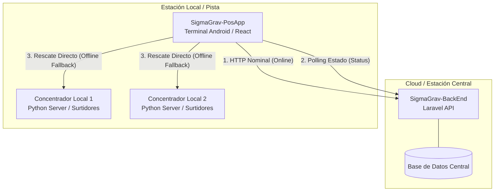
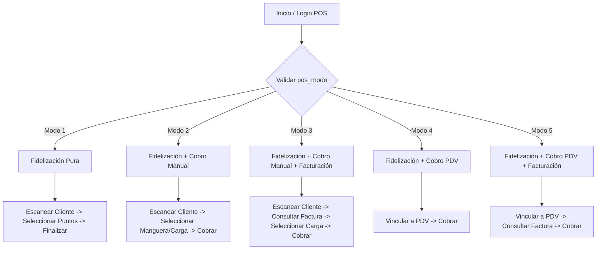
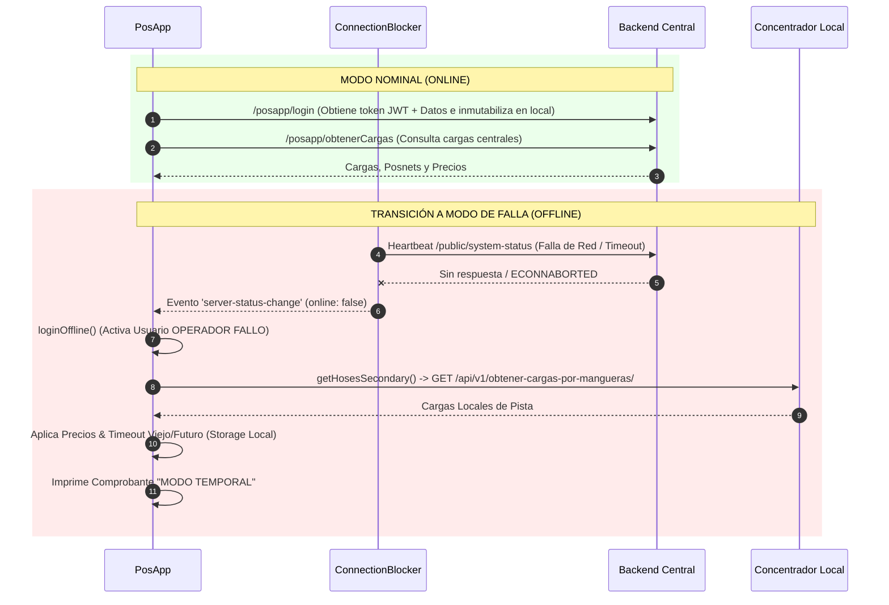
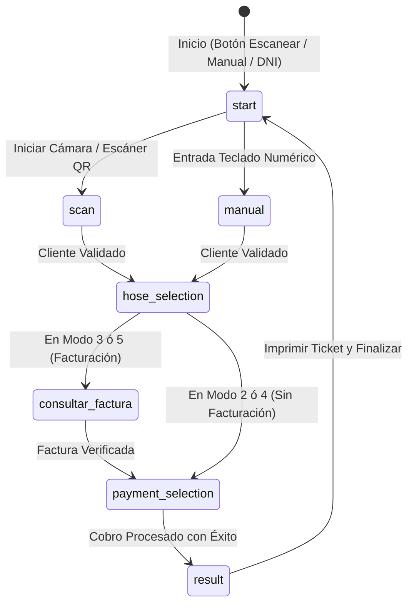

# Documentación Técnica: SigmaGrav-PosApp

Esta documentación describe la arquitectura, comportamiento, modos de operación y flujos de resiliencia del sistema **SigmaGrav-PosApp** (Terminal POS en punto de venta/pista), su integración con el backend central **SigmaGrav-BackEnd** (Laravel) y con la infraestructura local/concentradores **SigmaGrav-Concentrador** (Python).

---

## 1. Visión General y Arquitectura de Red

El ecosistema **SigmaGrav** opera mediante una arquitectura híbrida y distribuida diseñada para garantizar alta disponibilidad operativa durante el despacho de combustible y la fidelización de clientes en estaciones de servicio.

### Componentes Clave:
* **SigmaGrav-PosApp**: Aplicación web embebida en Android (Capacitor/React) para terminales de pago móviles (ej. Pax A910). Ejecuta la lógica de identificación de clientes, selección de manguera, cobro y fidelización.
* **SigmaGrav-BackEnd (Estación Central)**: Servidor de negocio central (Laravel Octane en puerto 8000/API). Administra usuarios, tarjetas, reglas de fidelización, sincronización de despacho y registro de transacciones globales.
* **SigmaGrav-Concentrador (Estación Local)**: Servidor local de pista (Python API en `/api/v1/`) directamente conectado a la placa de surtidores/aforadores. Mantiene las cargas en memoria local para consulta inmediata y contingencia.

---

## 2. Modos de Operación (`PosAppMode`)

`SigmaGrav-PosApp` ajusta su interfaz y flujo transaccional dinámicamente según la configuración asignada al perfil del POS en el backend (`pos_modo`).

| ID Modo | Nombre | Descripción del Comportamiento |
| :--- | :--- | :--- |
| **1** | `FIDELIZACION` | **Modo Fidelización Pura**: Identifica cliente (vía tarjeta QR/RFID o DNI) y registra/canjea puntos. No gestiona el pago de la carga ni selecciona mangueras. |
| **2** | `FIDELIZACION_COBRO_MANUAL` | **Fidelización + Cobro Manual**: El operador escanea al cliente, consulta las cargas disponibles por manguera y efectúa el cobro en el POS (Efectivo/Tarjeta/QR). |
| **3** | `FIDELIZACION_COBRO_MANUAL_FACTURACION` | **Cobro Manual con Consulta de Factura**: Similar al Modo 2, pero requiere paso previo de consulta/verificación de comprobantes o facturación existente. |
| **4** | `FIDELIZACION_COBRO_PDV` | **Fidelización + Cobro PDV**: Cobro integrado sincronizado desde un Punto de Venta (PDV) centralizado. |
| **5** | `FIDELIZACION_COBRO_PDV_FACTURACION` | **Cobro PDV con Facturación**: Integración PDV + Facturación activa. |

---

## 3. Resiliencia: Modo Nominal vs Modo de Falla

`SigmaGrav-PosApp` incluye un mecanismo de tolerancia a fallos de red sin interrupción de ventas (*Zero-Downtime Fallback*).

### 3.1. Modo Nominal (Online)
1. **Autenticación**: El usuario ingresa su CUIL y contraseña. Se envía POST a `/posapp/login` del servidor central.
2. **Inmutabilización de Datos Locales**: Al autenticar con éxito, el POS guarda de forma inmutable y encriptada (`setSecureItem`) la configuración operativa actual:
   * Módulos asignados (`pos_modulos`)
   * Concentradores y sus mangueras (`pos_concentradores`)
   * Reglas de fidelización y precios (`pos_fidelizacion_configs`, `pos_combustibles`)
   * Datos de la empresa/estación para impresión (`pos_datos_rotulo`: Razón Social, CUIT, Domicilio).
3. **Flujo Cargas**: Consulta regular vía POST `/posapp/obtenerCargas` al backend central.

### 3.2. Modo de Falla (Offline / Fallback)
1. **Detección Automática**: El componente `ConnectionBlocker` ejecuta una verificación periódica (cada 3 segundos) hacia `/system-status.json` o `/public/system-status`. Si falla o da tiempo de espera agotado, emite la alerta `'server-status-change'` (`window.isServerOnline = false`).
2. **Ingreso Offline**: El POS habilita el botón de contingencia **"Entrar a modo de fallo"**, ejecutando `loginOffline()`. Se asigna una sesión local temporal (`OPERADOR FALLO` con token `offline_fallback_token`).
3. **Consulta Distribución de Mangueras (`getHosesSecondary`)**:
   * PosApp identifica los concentradores no dependientes guardados localmente.
   * Consulta directamente vía HTTP local a los endpoints de los concentradores en pista:
     `POST {endpoint_concentrador}/api/v1/obtener-cargas-por-mangueras/`
   * Si no responden, recurre al `api_endpoint_secondary` configurado en el POS.
4. **Validación de Filtros y Precios Locales**:
   * Asocia las mangueras a los combustibles mapeados localmente (`pos_combustibles`).
   * Aplica reglas de timeout de cargas registradas (`TIMEOUT VIEJO` / `TIMEOUT FUTURO`) usando la fecha local.
5. **Impresión de Comprobante contingencia**:
   * Genera tickets ESC/POS locales etiquetados explícitamente como **"MODO TEMPORAL"**.
   * Se deshabilita la venta anticipada o canje diferido hasta el restablecimiento de la conexión.

---

## 4. Flujo de Pantallas de la Aplicación (`State Flow`)

El estado de navegación de `LayoutHome` evoluciona secuencialmente a través de la propiedad `step`:

### Descripción de Pasos:
1. **`start`**: Pantalla inicial con las opciones de escaneo QR/Tarjeta o ingreso por DNI.
2. **`scan` / `manual`**: Captura del identificador de la tarjeta o número de documento del cliente.
3. **`hose_selection`**: Visualización interactiva de surtidores/mangueras con despachos pendientes (litros, importe, combustible).
4. **`consultar_factura`**: (Exclusivo Modos 3 y 5) Verificación del estado de factura emitido.
5. **`payment_selection`**: Selección del medio de pago (Efectivo, Tarjeta de Débito/Crédito, Mercado Pago, Puntos).
6. **`result`**: Confirmación del procesamiento y comando de impresión de comprobante vía impresora térmica ESC/POS integradas.

---

## 5. Resumen de Métodos API Relevantes

| Componente | Método | Endpoint / Destino | Función |
| :--- | :--- | :--- | :--- |
| **Config.jsx** | `getLogin` | `POST /posapp/login` (Central) | Autenticación de operador y carga de configuración. |
| **Config.jsx** | `obtenerCargas` | `POST /posapp/obtenerCargas` (Central) | Obtiene cargas pendientes centralizadas en Modo Nominal. |
| **Config.jsx** | `obtenerCargasPorMangueras` | `POST /api/v1/obtener-cargas-por-mangueras/` (Local) | Obtiene cargas directamente del concentrador local en Modo Fallo. |
| **ApiService.jsx** | `getHosesSecondary` | Algoritmo Multinegocio | Distribuye la consulta entre concentradores locales no dependientes. |
| **ConnectionBlocker.jsx** | `checkStatus` | `GET /public/system-status` | Polling constante de conectividad para detectar Modo Fallo/Nominal. |
