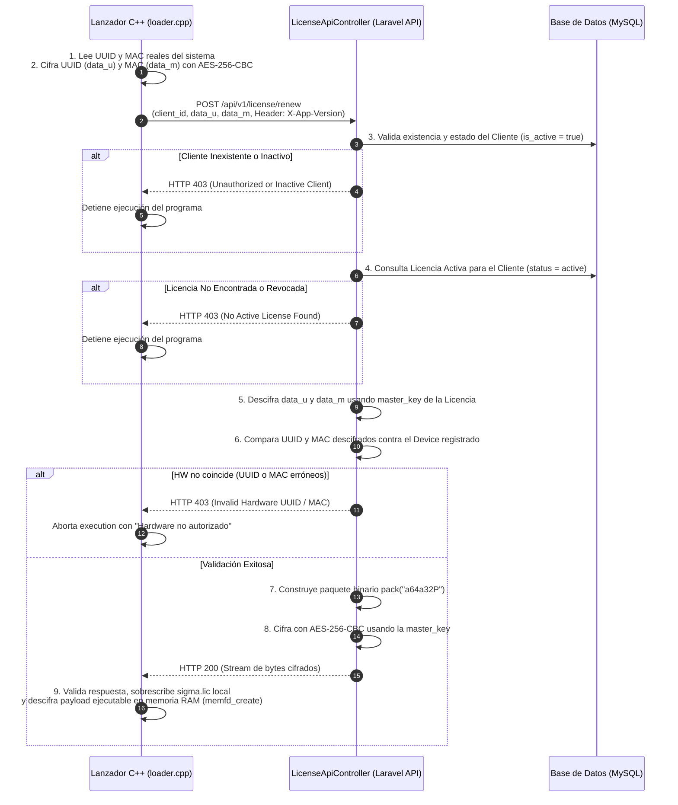

# Cadena de Licenciamiento y Validación de Hardware (SigmaGrav)

Este documento describe la arquitectura criptográfica, los modelos y la cadena completa de generación, verificación y renovación remota de licencias en la plataforma **SigmaGrav**, alineada exactamente con la implementación del ejecutable empaquetado **`loader.cpp`** (`/home/burger/workspace/repos/SigmaGrav/SigmaGrav-Tools/Herramientas/SigmaGrav/encriptadorBinario`).

---

## 1. Integración con el Encriptador Binario (`loader.cpp`)

El sistema de licencias del backend Laravel en `SigmaGrav-Web/Api` fue desarrollado respetando de manera **exacta y 100% compatible** la especificación de diseño del lanzador protector nativo en C++ (`loader.cpp`).

### Correspondencia entre Componentes:

| Componente C++ (`loader.cpp`) | Backend Laravel (`SigmaGrav-Web/Api`) | Descripción |
| :--- | :--- | :--- |
| `MASTER_KEY` | `licenses.master_key` | Clave de 64 caracteres hexadecimales (256 bits) usada para derivar Key/IV |
| `struct LicenseData` | `pack("a64a32P")` | Estructura binaria nativa en memoria (64B UUID + 32B MAC + 8B Timestamp uint64) |
| `CLIENT_ID` | `clients.code` | Identificador único del cliente (ej: `LIDERGAS_001`) |
| `get_hw_uuid()` | `devices.uuid` | UUID del sistema leído desde `/sys/class/dmi/id/product_uuid` |
| `get_mac_address()` | `devices.mac` | Dirección MAC física de la interfaz de red activa |
| `X-App-Version` | `licenses.app_version` | Encabezado HTTP de versión enviada por `libcurl` |
| `sigma.lic` | Binario servido en `/licenses/{id}/download` | Archivo binario local que contiene la licencia cifrada |

---

## 2. Formato del Archivo Binario `sigma.lic`

En C++, `loader.cpp` mapea el archivo `sigma.lic` directamente a la siguiente estructura C:

```cpp
struct LicenseData {
    char uuid[64];      // 64 bytes para UUID
    char mac[32];       // 32 bytes para Dirección MAC
    long long expiry;   // 8 bytes (64 bits) timestamp UNIX de vencimiento
};
```

En el backend Laravel, esta estructura binaria exacta se genera empaquetando los valores con `pack("a64a32P", $uuid, $mac, $timestamp)` y cifrando el resultado con **AES-256-CBC**:

- **Key (32 bytes):** `pack("H*", substr($masterKeyHex, 0, 64))`
- **IV (16 bytes):** `pack("H*", substr($masterKeyHex, 0, 32))`

---

## 3. Cadena de Validación y Renovación Remota

El ejecutable `loader.cpp` incluye un hilo supervisor (*watcher thread*) que se ejecuta en segundo plano. Si el archivo `sigma.lic` está ausente, expiró o fue alterado, o si han transcurrido 24 horas, `loader.cpp` invoca la función `try_auto_renew()` mediante `libcurl`:



---

## 4. Gestión desde el Dashboard Web

1. **Equipos (`/dashboard/devices`):**
   - Se registran los servidores o postnets con su UUID (`cat /sys/class/dmi/id/product_uuid`) y su dirección MAC.
2. **Licencias (`/dashboard/licenses`):**
   - Se vinculan al Cliente y/o Equipo.
   - Se genera el archivo **`sigma.lic`** que el administrador puede descargar e incluir en la instalación inicial junto con el binario `loader`.
