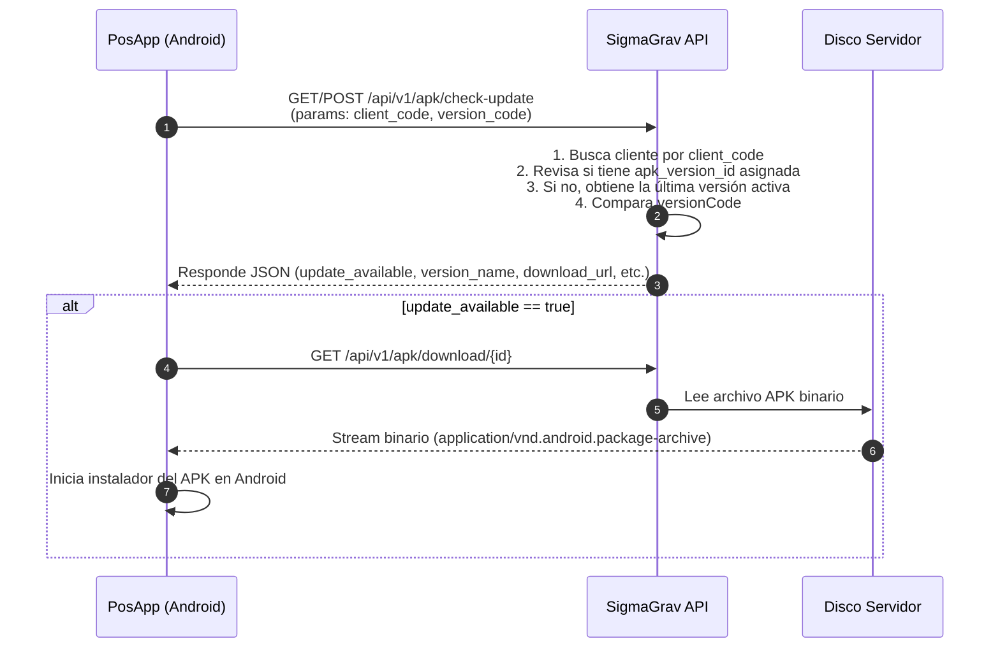

# Procedimiento de Gestión y Actualización de APKs (PosApp Android)

Este documento detalla el procedimiento de administración, servicio y actualización remota de versiones de APK para la aplicación de terminales posnet **PosApp (Android)** en el ecosistema **SigmaGrav**.

---

## 1. Publicación de Versiones desde el Dashboard Web

El módulo de administración web se ubica en **`📱 Versiones APK`** (`/dashboard/apks`).

### Flujo de Subida en 2 Pasos
1. **Paso 1: Arrastrar y Analizar**
   - El administrador hace clic en `+ Subir Nueva Versión APK`.
   - Arrastra el archivo `.apk` o hace clic en la zona de carga (*dropzone*).
   - Al presionar `Analizar APK →`, el archivo se sube a un directorio de almacenamiento temporal (`storage/app/public/apks_temp/`).
   - La librería de PHP `tufanbarisyildirim/php-apk-parser` lee internamente el `AndroidManifest.xml` del binario.

2. **Paso 2: Confirmación de Metadatos y Changelog**
   - Se despliega automáticamente el modal de confirmación con los siguientes campos autocompletados (modo lectura):
     - **Nombre de Versión (`version_name`)**: Ej. `1.0.4`.
     - **Código de Versión (`version_code`)**: Ej. `104`.
   - Se debe ingresar **obligatoriamente** la descripción de cambios en **Notas de la Versión / Changelog**.
   - Se marca si la versión estará activa para descargas de clientes.
   - Al hacer clic en `Guardar y Publicar APK`, el archivo se traslada a la carpeta definitiva `storage/app/public/apks/` y la versión queda registrada.

> **Control de Almacenamiento:** Si el usuario cancela en el Paso 2 o si la subida falla, el sistema borra de forma transparente el archivo temporal del disco evitando la acumulación de basura.

---

## 2. Asignación de Versión por Cliente

Por defecto, todos los clientes reciben la **última versión activa** disponible en la base de datos. Sin embargo, es posible fijar una versión específica para clientes determinados:

1. Ingresar a **`🏢 Clientes`** (`/dashboard/clients`).
2. Editar el cliente correspondiente.
3. En la opción **Versión APK PosApp Asignada**, seleccionar la versión específica requerida o dejar seleccionada la opción `-- Última versión disponible por defecto --`.
4. Guardar los cambios.

---

## 3. Integración con la App PosApp (Terminales Posnet Android)

La terminal posnet interactúa con los endpoints REST del backend Laravel según el siguiente diagrama:



---

## 4. Referencia de Endpoints API

### A) Consulta de Actualización
* **Ruta:** `/api/v1/apk/check-update`
* **Método:** `GET` | `POST`
* **Parámetros:**
  * `client_code` *(string)*: Código único del cliente (ej: `LIDERGAS_001`).
  * `version_code` *(integer)*: Código entero de la versión instalada en el posnet (ej: `100`).

* **Respuesta de ejemplo (Actualización Disponible):**
  ```json
  {
    "success": true,
    "update_available": true,
    "version_name": "1.0.4",
    "version_code": 104,
    "file_size": 69564228,
    "checksum_sha256": "8d96b...e8a2",
    "changelog": "Integración con impresoras térmicas y corrección en cierre de lote.",
    "download_url": "http://servidor-api.com/api/v1/apk/download/3"
  }
  ```

### B) Descarga del APK
* **Ruta:** `/api/v1/apk/download/{id}`
* **Método:** `GET`
* **Descripción:** Sirve el archivo `.apk` binario con el header `Content-Type: application/vnd.android.package-archive` listo para la descarga e instalación.

---

## 5. Requisitos de Configuración en Servidores (PHP / Hosting)

Debido al tamaño de los paquetes APK (generalmente superiores a 10MB), se debe garantizar la siguiente configuración en PHP (`php.ini` / `hPanel` / `.htaccess`):

```ini
upload_max_filesize = 128M
post_max_size = 128M
memory_limit = 256M
max_execution_time = 300
max_input_time = 300
```
